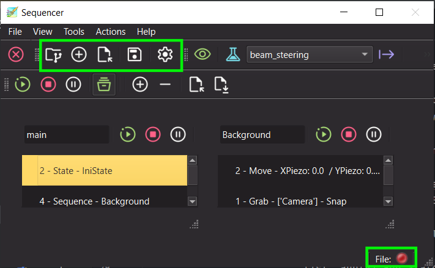

.. _h5manager:

The H5 file manager
===================

Many applications and extensions of PyMoDAQ save data in a h5 file: the :ref:`DAQ_Scan_module`, the
:ref:`DAQ_Logger <DAQ_Logger_module>`, the :ref:`Sequencer <sequencer_extension>`, the Ramping extension... They all
handle this file the same way, through the **H5Manager**: an object attached to every ``CustomApp`` (hence every
extension) that takes care of opening, creating and closing the h5 file, and exposes the corresponding actions in a
toolbar, a menu and the status bar.

This page describes its behaviour and its actions, from a user point of view first, then for developers wanting to
use it in their own application.

.. _h5manager_fig:

   The file toolbar of the H5Manager (left) and its indicators in the status bar (right).

Which file is used?
-------------------

The H5Manager uses an :ref:`H5Saver <h5saver_module>` to write in the h5 file. When an application needs the file
(to save or log data) and no file is open yet:

* if a file was already used by this application and it still exists, it is reopened, in append mode
* otherwise, a **new file** is automatically created following the standard naming convention:

  .. code-block:: text

     <base path>/<year>/<yyyymmdd>/Dataset_<yyyymmdd>_<nnn>.h5

  where ``<base path>`` is the *Base path* setting of the H5Saver (by default the ``data_saving / h5file /
  save_path`` entry of the :ref:`configuration <section_configuration>`), the year and day folders are created if
  needed, and ``<nnn>`` is incremented so that an existing file is never overwritten

You can choose another file at any time using the file actions described below: new data will then be written to the
file you selected.

.. note::

   A h5 file can only be written by one application at a time. If the file to be reopened is locked (for instance
   because it is open in another application), a dialog lets you choose to:

   * **Retry**, once the file has been closed elsewhere
   * create a **New File (Auto)** following the naming convention
   * **Browse...** for another existing file to append to
   * **Cancel**: the file is left closed

   If the file cannot be reopened for another reason, a new file is created automatically.

File actions
------------

The actions are available in the file toolbar of the application (:numref:`h5manager_fig`) and in its *File* menu:

.. list-table::
   :header-rows: 1
   :widths: 25 75

   * - Action
     - Description
   * - **Show file content**
     - opens the current file in the :ref:`H5Browser_module` to explore its content
   * - **New file**
     - closes the current file and creates a new one, following the naming convention above. Subsequent data will be
       saved in this new file
   * - **Open file to append...**
     - selects an existing h5 file: subsequent data will be appended to it
   * - **Save copy as...**
     - saves a copy of the current file under another name
   * - **Show h5 settings**
     - shows/hides the settings of the H5Saver (base path, base name, backend, compression...), see
       :ref:`h5saver_module`
   * - **Open Current File** / **Close Current File**
     - reopens/closes the current file, for instance to release the file lock. These actions are hidden by default

Each application can hide some of these actions: for instance the DAQ_Scan doesn't display the *Show h5 settings*
action as its saving settings are always visible in its settings tree.

Status bar
----------

Applications using it display in their status bar (:numref:`h5manager_fig`):

* a **File** LED: green when the h5 file is open and accessible, red otherwise
* a **SWMR** label, when the file uses the Single Writer Multiple Reader mode of the h5py backend:

  * *SWMR* when this mode is active
  * *SWMR file* when the file was created with SWMR support but this mode is not currently active
  * hidden when the file has no SWMR association

Using the H5Manager in your application
---------------------------------------

Every ``CustomApp`` (see :ref:`custom_app`) owns a H5Manager, available through its ``h5_manager`` property. A few
class attributes and arguments control how it is displayed:

* the ``h5_actions_not`` argument of ``CustomApp.__init__``: an iterable of ``FileAction`` (from
  ``pymodaq_gui.managers.h5manager``) not to be displayed. Default is ``(FileAction.CLOSE_FILE,
  FileAction.OPEN_FILE)``
* the ``show_h5file_statusbar_widgets`` class attribute: set it to ``True`` to display the File LED and SWMR label in
  the status bar (done in ``populate_status_bar``)

The file toolbar (``h5_manager.toolbar``) is not added to the main window automatically. Add it, for instance in your
``setup_menus_and_toolbars`` method, as done in the Sequencer:

.. code-block:: python

    from pymodaq_gui.utils.enums import MenuToolbarNames

    def setup_menus_and_toolbars(self, menubar=None):
        self.add_toolbar(MenuToolbarNames.FILE, MenuToolbarNames.FILE.capitalize(), self.mainwindow,
                         toolbar=self.h5_manager.toolbar, add_break=False)

The H5Saver itself is obtained from the manager:

* ``h5_manager.h5saver``: the H5Saver with an open file. Accessing this property reopens the current file or creates a
  new one if needed, as described in `Which file is used?`_
* ``h5_manager.get_h5saver(create_new_file=False, mode='a')``: same but with more control: no new file is created
  unless ``create_new_file`` is ``True``, and the file can be opened read-only with ``mode='r'``. Use it when you
  only need the H5Saver settings or don't want to create a file at startup

The manager emits signals your application can connect to:

* ``command_sig``: emitted with a ``ThreadCommand`` whose command is the triggered ``FileAction``, for instance to
  reset your application state when a new file has been loaded
* ``file_open_signal``: emitted with ``True`` when a file has been (re)opened, ``False`` if the user cancelled
* ``file_loaded_signal``: emitted with the path of a file selected using *Open file to append...*

Finally, ``h5_manager.close_file()`` flushes and closes the file. Call it when your application quits so the file is
released. See :ref:`H5SaverClassDescr` for the API of the saving classes.
