.. _plotting_data:
.. _data_viewers:

Plotting Data
=============

Data in PyMoDAQ are featured with a lot of metadata, allowing their
proper description and enabling seamlessly saving/loading to hdf5 files.
But what about representation? Analysis? Exploration?

With Python you usually do this by writing a script and manipulate and
plot your data using your favorite backend (matplotlib, plotly, qt,
tkinter, …) However because PyMoDAQ is highly graphical you won't need
that. PyMoDAQ is featured with various data viewers allowing you to plot
any kind of data. You'll see below some nice examples of how to plot
your PyMoDAQ's data using the builtin data viewers.

.. note:: The content of this chapter is available as a `notebook <https://github.com/PyMoDAQ/notebooks/tree/main/notebooks>`__.

  To execute this notebook properly, you'll need PyMoDAQ >=
  4.0.2 (if not released yet, you can get it from github)

.. _viewer0D:

Plotting scalars: Viewer0D
--------------------------

Scalars or `Data0D` data are the simplest form of data. However, just
displaying numbers is somewhat lacking (in particular when one want to
compare data evolution over time, or parameter change…). This is why it
is important to keep track of the history of the scalar values. The
`Viewer0D`, see below, has such an history as well as tools to keep
track of the maximal reached value.

.. code:: ipython3

    %gui qt
    import numpy as np
    
    from pymodaq.utils.plotting.data_viewers.viewer0D import Viewer0D
    from pymodaq.utils.data import DataRaw
    
    dwa = DataRaw('my_scalar', data=[np.array([10.6]), np.array([-4.6])],
                  labels=['scalar1', 'scalar2'])
    viewer0D = Viewer0D()
    

.. code:: ipython3

    viewer0D.show_data(dwa)

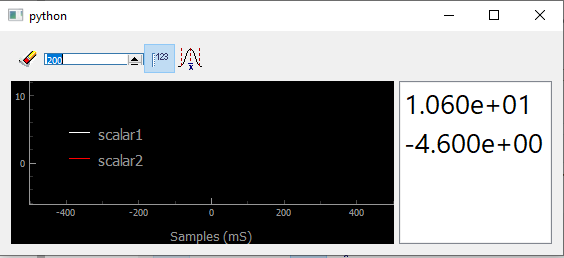

   Showing scalars in a `Viewer0D`

Well not much can be seen except for the numbers printed on the right
(shown by clicking on the dedicated button |image_123|). But what if I call
several times the `show_data` method to display evolving signal?

.. note:: We recall that a `DataRaw` is a particular case of a more
  generic DataWithAxes (*dwa* in short) having its source set to *raw*

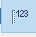

.. code:: ipython3

    for ind in range(100):
        dwa = DataRaw('my_scalar', data=[np.sin([ind / 100 * 2*np.pi]),
                                         np.sin([ind / 100 * 2*np.pi + np.pi/4])],
                     labels=['mysinus', 'my_dephased_sinus'])
        viewer0D.show_data(dwa)

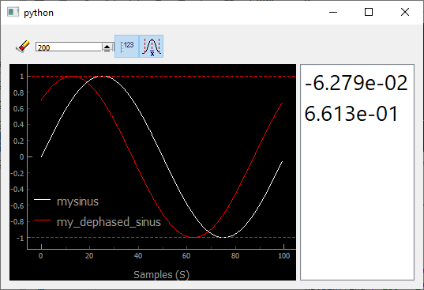

   Showing an history of scalars, together with their min and max values
   (dashed lines)

You immediately see the usefulness of such an history, allowing for
instance to optimize signals when tweaking a parameter especially if you
use the dashed lines, triggered by |Min/Max dashed lines|, showing the
values of the min and max reached values.

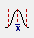

Plotting vectors/waveforms: Viewer1D
------------------------------------

When increasing complexity, one get one dimensional data. It has one
more important metadata, its axis. Properly defining the data object
will translate into rich plots:

.. code:: ipython3

    from pymodaq.utils import math_utils as mutils
    from pymodaq.utils.data import Axis
    
    axis = Axis('my axis', units='my units', data=np.linspace(-10000, 10000, 100))
    
    dwa1D = DataRaw('my_1D_data', data=[mutils.gauss1D(axis.get_data(), 3300, 2500),
                                        mutils.gauss1D(axis.get_data(), -4000, 1500) * 0.5],
                    labels=['a gaussian', 'another gaussian'],
                    axes=[axis],
                    errors=[0.1* np.random.random_sample((axis.size,)) for _ in range(2)])
    dwa.plot('qt')

.. note::
  One can directly call the method `plot` on a data object,
  PyMoDAQ will determine which data viewer to use.

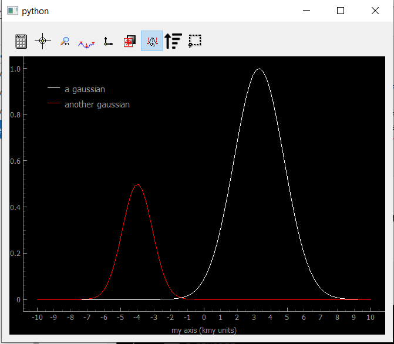

   Showing Data1D

You can see the legends correspond to the data labels, while the axis
shows both the label and the units in scientific notation (notice the k
before ‘my units' standing for kilo).

As for the buttons in the toolbar (you can try them from the notebook):

-  |Showing Data1D|: opens the ROI (region of interest) manager, to
   load, save and define ROI to apply to the data. This will create
   cropped Data0D from the application of an operation on the
   cropped data such as *mean*, *sum*, *std*\ … See figure below, showing
   the mean value on the bottom panel. ROI can be applied to one of the
   trace or to both as reflected by the legends
-  |crosshair1D|: activate the crosshair (yellow vertical line) that can be
   grabed and translated. The data at the crosshair position is printed
   on the right of the toolbar.
-  |aspect1D|: fix the horizontal/vertical aspect ratio (usefull for xy
   plot see below)
-  |dot|: as shown on the figure below, one can switch between solid
   line or only dots.
-  |xy|: when data contains two waveforms, using this button will
   display them in XY mode.
-  |overlay|: when activated, an overlay of the current data will be
   depicted with a dash line.
-  |sort|: if the axis data is not monotonous, data will be
   represented as a scrambled solid line, using this button will reorder
   the data by ascending values of its axis. See below and figure xx
-  |errors|: when activated, will display errors (error bars) in the form of a area around the curve
-  |roiselect|: extra ROI that can be used independantly of the ROI manager

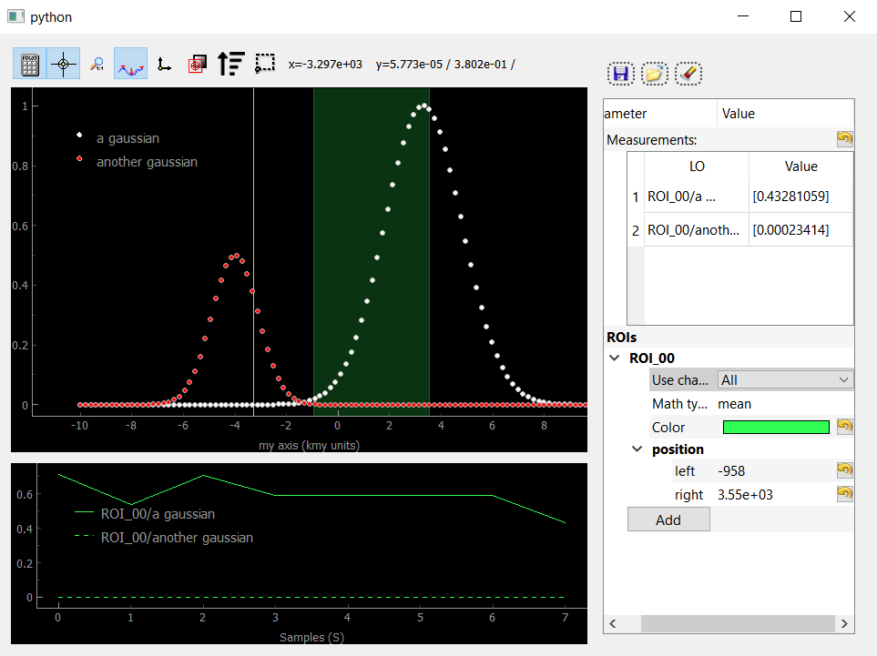

   Showing Data1D as dots and with an activated ROI and crosshair

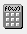
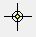
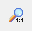
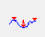
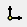
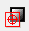
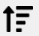
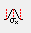
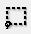

If :ref:`errors` are defined in the data object, the Viewer1D can easily plot them:

.. _errors_fig_1D:
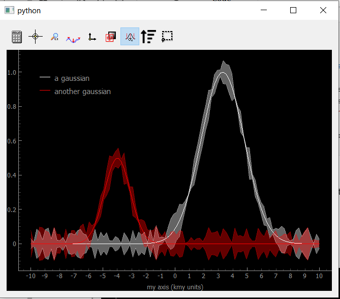

   Showing Data1D with error bars as an area around the curves.

If the axis data is not monotonous, data will be represented as a
scrambled solid line, for instance:

.. code:: ipython3

    axis_shuffled_array = axis.get_data() 
    np.random.shuffle(axis_shuffled_array)
    axis_shuffled = Axis('my axis', units='my units', data=axis_shuffled_array)
    
    dwa = DataRaw('my_1D_data', data=[mutils.gauss1D(axis_shuffled.get_data(), 3300, 2500),
                                      mutils.gauss1D(axis_shuffled.get_data(), -4000, 1500) * 0.5],
                  labels=['a gaussian', 'another gaussian'],
                  axes=[axis_shuffled])
    dwa.plot('qt')

.. _shuffled_fig_1D:
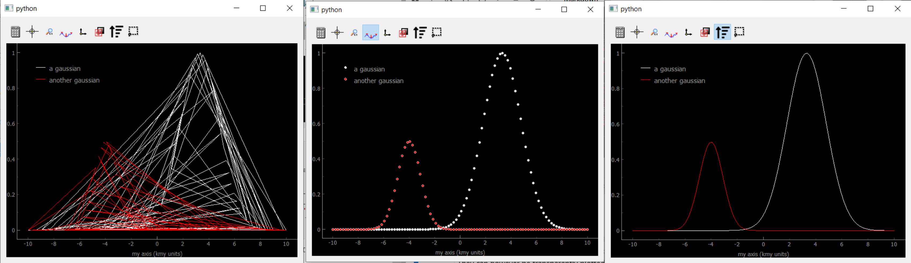

   Showing Data1D Spread. The scrambled lines (left) still represents Gaussians, it is just that
   the random ordering scrambled the lines. If one remove the lines by
   clicking the `dot only` button, the Gaussians reappear (middle). They
   reappear also after pressing the sort button (right).

Plotting 2D data
----------------

2D data can be either an image (pixels on a regular grid) or a
collection of scalars with XY coordinates. PyMoDAQ introduce therefore
the notion of “uniform” data for the former and “spread” data for the
later. They can however be transparently plotted on the same
`Viewer2D` data viewer. One will first show both cases before
discussing the `Viewer2D` toolbar.

Uniform data
~~~~~~~~~~~~

Let's generate data displaying 2D Gaussian distributions:

.. code:: ipython3

    # generating uniform 2D data
    NX = 100
    NY = 50
    x_axis = Axis('xaxis', 'xunits', data=np.linspace(-20, 20, NX), index=1)
    y_axis = Axis('yaxis', 'yunits', data=np.linspace(20, 40, NY), index=0)
    
    data_arrays_2D = [mutils.gauss2D(x_axis.get_data(), -5, 10, y_axis.get_data(), 25, 2) +
                      mutils.gauss2D(x_axis.get_data(), -5, 5, y_axis.get_data(), 35, 2) * 0.01,
                     mutils.gauss2D(x_axis.get_data(), 5, 5, y_axis.get_data(), 30, 8)]
    data2D = DataRaw('data2DUniform', data=data_arrays_2D, axes=[x_axis, y_axis],
                    labels=['red gaussian', 'green gaussian'])
    data2D.plot('qt')

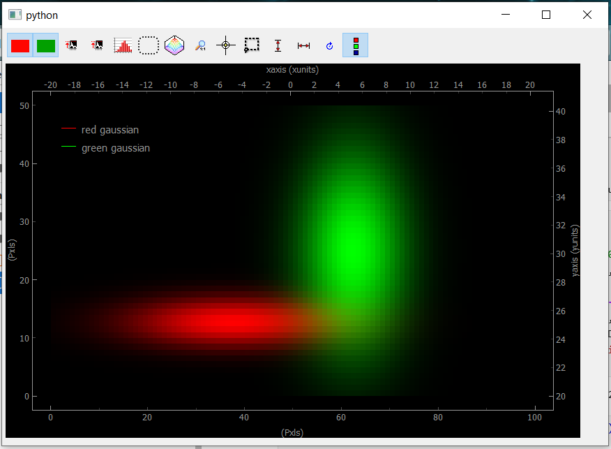

   Showing uniform Data2D

The bottom and left axes correspond to the image pixels while the right
and top ones correspond to the real physical axes defined in the data
object. When several arrays are included into the data object, they will
be displayed as RGB layers. Data visibility can be set using the
red/green (blue) buttons. If only one array is used, the color will be
white.

Spread Data
~~~~~~~~~~~

Spread 2D data are typically what you get when doing a `Spread` or
`Tabular` 2D scan, see :ref:`scanner_paragraph`. By the way,
`Spread` or `Tabular` 1D scan would typically give the scrambled
plot on figure :numref:`shuffled_fig_1D`. Let's generate and plot such 2D data

.. code:: ipython3

    # generating Npts of spread 2D data
    N = 100
    x_axis_array = np.random.randint(-20, 50, size=N)
    y_axis_array = np.random.randint(20, 40, size=N)

    x_axis = Axis('xaxis', 'xunits', data=x_axis_array, index=0, spread_order=0)
    y_axis = Axis('yaxis', 'yunits', data=y_axis_array, index=0, spread_order=1)
    
    data_list = []
    for ind in range(N):
        data_list.append(mutils.gauss2D(x_axis.get_data()[ind], 10, 15,
                                        y_axis.get_data()[ind], 30, 5))
    data_array = np.squeeze(np.array(data_list))
    
    data2D_spread = DataRaw('data2DSpread', data=[data_array],
                             axes=[x_axis, y_axis],
                             distribution='spread',
                             nav_indexes=(0,))
    data2D_spread.plot('qt')

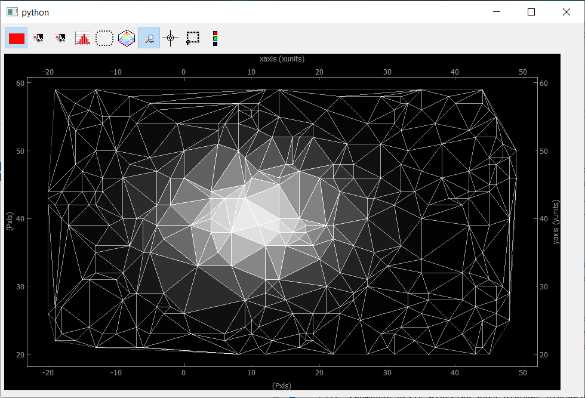

   Showing Data2D Spread. Each point in the spread collection is a vertex in the mesh while the
   color of the triangle is given by the mean of the three vertex.

If we go back to the construction of the data object, you may have
noticed the introduction of a `nav_indexes` parameter and a
`distribution` parameter. The latter is usually and by default equal
to `uniform` but here we have to specify that the data will be a
collection of `spread` points.

By construction, `spread` data have
navigation axes, the coordinates of the points (note that the scalar
*points* in our example could also be `Data1D` or `Data2D` *points*,
we'll see that with the `ViewerND`) and specifying the distribution to
`spread` allows PyMoDAQ to handle this properly compared to the
`uniform` case.

But then, the parameter `nav_indexes` is used to
specify which dimension of the data array will be considered navigation,
the rest beeing signal. However in our collection, the shape of the data
is only `(100,)` so `nav_indexes` is `(0, )`. But still, we do
have two axes: the X and Y coordinates of our points… To handle this,
the Axis object has to include a new parameter, the `spread_order`
specifying which axis corresponds to which coordinate but both refering
to the same `navigation` dimension of the data.

Toolbar
~~~~~~~

As for the buttons in the toolbar (you can try them from the notebook):

-  |Viewer2D|: Show/Hide the corresponding data
-  |autoscale|: Autoscale on the color scale (between 0 and max or between
   -max and max)
-  |histogram|: display the histogram panel, allowing manual control of the
   colors and color saturation. See figure below.
-  |roi2D|: Open the ROI manager allowing to load, save and define
   rectangular of elliptical regions of interest. Each of these ROI will
   produce `Data1D` data (lineouts by vertical and horizontal
   application of a mathematical function: mean, sum… along horizontal
   or vertical axis of the ROI) and `Data0D` by application of the
   same mathematical function along both axes of the ROI.
-  |isocurve|: shows an isocurve specified by the position of a green line
   on the histogram
-  |aspect2D|: set the aspect ratio to one
-  |crosshair2D|: activate the crosshair (see figure below)
-  |roi_select2D|: extra rectangular ROI that can be used independently of the
   ROI manager
-  |orientation|: flip or rotate the image
-  |legend|: show/hide the legend (see figure below)

.. _saturated_fig:

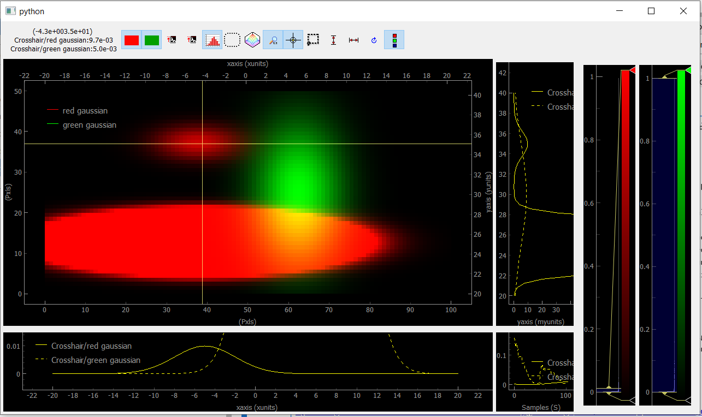

   Viewer2D with toolbar buttons activated and image saturation from the histogram.

On figure :numref:`saturated_fig`, the histogram has been activated and we rescaled
the red colorbar to saturate the red plot and make the tiny Gaussian that was hidden to
appear. We also activated the crosshair that induced the plotting of `Data1D`
(taken for both channel along the crosshair lines) and
`Data0D` (at the crosshair position and plotted on the bottom right).

.. _NDviewer:

Plotting all other data
-----------------------

All data that doesn't fit the explanations above should be plotted using
the `ViewerND`. This viewer is a combination of several `Viewer0D`,
`Viewer1D` and `Viewer2D` allowing to plot almost any kind of data.
The figure below shows the basic look of the `ViewerND`. It consists
in a Navigation panel and a Signal panel, dealing with the notion of
signal/navigation, see :ref:`DataND <navigation_signal>`.

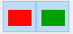
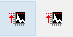
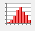
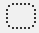
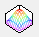
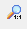
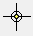

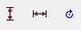
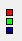
.. |Showing Data2D with saturation and crosshair| image::

.. code:: ipython3

    from pymodaq.utils.plotting.data_viewers.viewerND import ViewerND
    viewerND = ViewerND()

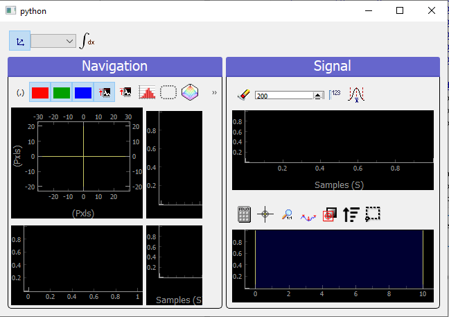

   An empty `ViewerND`

Not much yet to say about it, but let's load some complex data and plot
it with this viewer. For the first example, we'll get tomographic data
(3D) from the human brain. We'll get that from the *Statistical
Parametric Mapping* software website hosted
`here <http://www.fil.ion.ucl.ac.uk/spm>`__.

.. code:: ipython3

    import tempfile
    from pathlib import Path
    import zipfile
    from urllib.request import urlretrieve
    import nibabel
    
    # Create a temporary directory
    with tempfile.TemporaryDirectory() as directory_name:
        directory = Path(directory_name)
        # Define URL
        url = 'http://www.fil.ion.ucl.ac.uk/spm/download/data/attention/attention.zip'
    
        # Retrieve the data, it takes some time
        fn, info = urlretrieve(url, directory.joinpath('attention.zip'))
    
        # Extract the contents into the temporary directory we created earlier
        zipfile.ZipFile(fn).extractall(path=directory)
    
        # Read the image
        struct = nibabel.load(directory.joinpath('attention/structural/nsM00587_0002.hdr'))
    
        # Get a plain NumPy array, without all the metadata
        array_3D = struct.get_fdata()
    
    dwa3D = DataRaw('my brain', data=array_3D, nav_indexes=(2,))
    dwa3D.create_missing_axes()
    
    viewerND.show_data(dwa3D)  # or just do dwa3D.plot('qt')

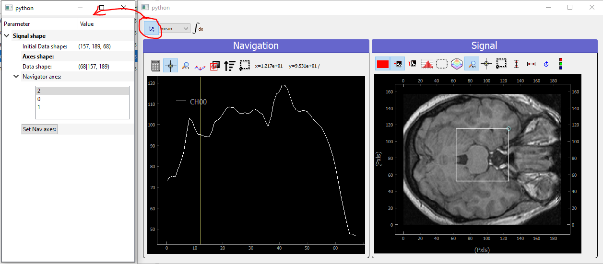

   Showing brain 3D data on a ViewerND

Here you now see the image of the brain (signal part) at a certain
height (12.17, navigation part) within the skull. The signal data is
taken at the height corresponding to the crosshair vertical line within
the navigation panel. Moving it laterally will display a different brain
z-cut. The navigation 1D plot is calculated from the white ROI on the
signal panel, applying the mathematical function to it (here *mean* see
on top of the plot) and displaying this for all z-cut on the navigation
panel. Therefore, moving this ROI will change the printed navigation
plot. Another widget (on the left) displays information on the data: its
shape and navigation/signal dimensions. From this, one can also change
which axes are navigation (here this is axis 2 as specified when the
data object has been constructed). In the notebook, you can change this,
selecting one, two or even the three indexes and see how it's impacting
on the `ViewerND`.

Some buttons in the toolbar can be used to better control the data
exploration:

-  |Indexes selection|: opens a side window to control navigation axes
-  |image1|: select which mathematical operator to apply to the signal
   ROI in order to plot meaningfull navigation data
-  |image2|: if activated, another signal plot will be generated
   depicting not the data indexed at the position of the crosshair but
   integrated over all navigation axes

Signal data dimension cannot exeed 2, meaning you can only plot signal
that are `Data0D`, `Data1D` or `Data2D` which make sense as only
this kind of data are produced by usual detectors. On the navigation
side however, on can have as many navigation axes as needed. Below
you'll see some possibilities.

Uniform Data
~~~~~~~~~~~~

Le'ts first create a 4D Data object, we'll then see various
representations as a function of its navigation indexes

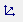
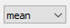
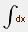

.. code:: ipython3

    x = mutils.linspace_step(-10, 10, 0.2)
    y = mutils.linspace_step(-30, 30, 1)
    t = mutils.linspace_step(-100, 100, 2)
    z = mutils.linspace_step(0, 50, 0.5)
    
    data = np.zeros((len(y), len(x), len(t), len(z)))
    amp = np.ones((len(y), len(x), len(t), len(z)))
    for indx in range(len(x)):
        for indy in range(len(y)):
            data[indy, indx, :, :] = amp[indy, indx] * (
                    mutils.gauss2D(z, 0 + indx * 1, 20,
                                   t, 0 + 2 * indy, 30)
                    + np.random.rand(len(t), len(z)) / 5)
    
    dwa = DataRaw('NDdata', data=data, dim='DataND', nav_indexes=(0, 1),
                  axes=[Axis(data=y, index=0, label='y_axis', units='yunits'),
                        Axis(data=x, index=1, label='x_axis', units='xunits'),
                        Axis(data=t, index=2, label='t_axis', units='tunits'),
                        Axis(data=z, index=3, label='z_axis', units='zunits')])
    
    dwa.plot('qt')

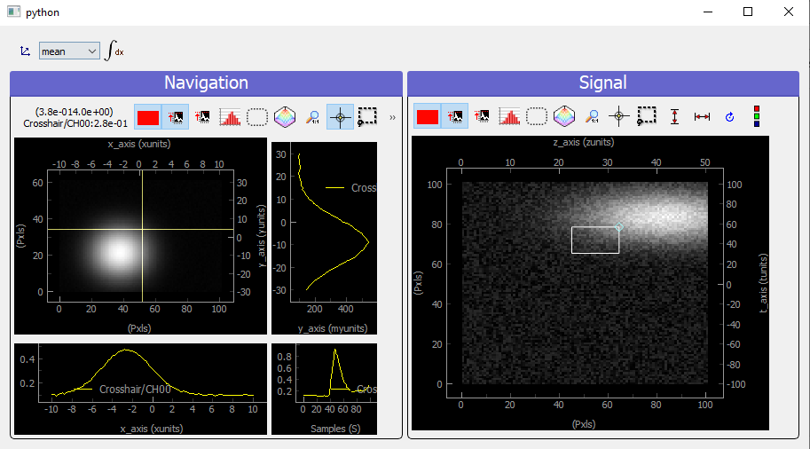

   Showing 4D uniform data on a ViewerND with two navigation axes

We use here (but it's done automatically from the metadata) two `Viewer2D` to plot both navigation and signal data. If
we increase the number of navigation axes, it is no more possible to use
the same approach.

.. code:: ipython3

    dwa.nav_indexes = (0, 1, 2) 
    dwa.plot('qt')

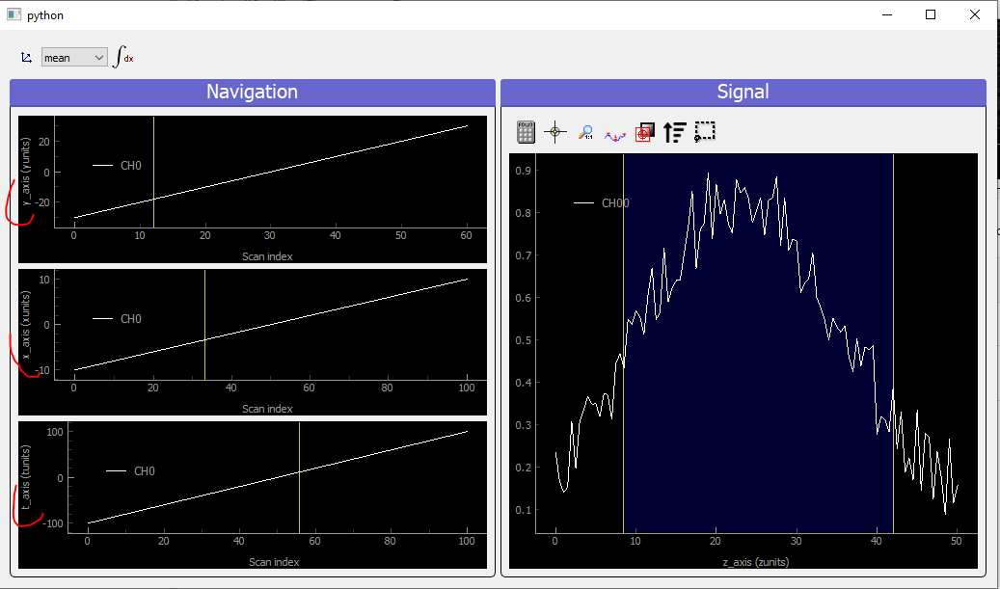

   Showing 4D uniform data on a ViewerND with three navigation axes

In that case where there are three (it could be any number >2) navigation axes. Each axis
is plotted into a dedicated viewer together with a vertical yellow line
allowing to index (and slice) data at this position, updating accordingly
the depicted signal data

Spread Data
~~~~~~~~~~~

For `Spread` data, things are different because all navigation axes
have the same length (they are the ND-coordinates of the signal data),
they can therefore be plotted into the same `Viewer1D`:

.. code:: ipython3

    N = 100
    
    x = np.sin(np.linspace(0, 4 * np.pi, N))
    y = np.sin(np.linspace(0, 4 * np.pi, N) + np.pi/6)
    z = np.sin(np.linspace(0, 4 * np.pi, N) + np.pi/3)
    
    Nsig = 200
    axis = Axis('signal axis', 'signal units', data=np.linspace(-10, 10, Nsig), index=1)
    data = np.zeros((N, Nsig))
    for ind in range(N):
         data[ind,:] = mutils.gauss1D(axis.get_data(), 5 * np.sqrt(x[ind]**2 + y[ind]**2 + z[ind]**2) -5 , 2) + 0.2 * np.random.rand(Nsig)
    
    dwa = DataRaw('NDdata', data=data, distribution='spread', dim='DataND', nav_indexes=(0,),
                  axes=[Axis(data=x, index=0, label='x_axis', units='xunits', spread_order=0),
                        Axis(data=y, index=0, label='y_axis', units='yunits', spread_order=0),
                        Axis(data=z, index=0, label='z_axis', units='zunits', spread_order=0),
                       axis])
    
    dwa.plot('qt')

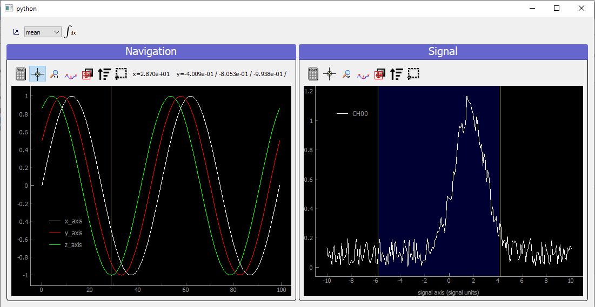

   Showing 4D spread data on a ViewerND

In that case, the navigation panel is showing on the same `Viewer1D`
all navigation *spread* axes (coordinates), while the signal panel shows
the signal data at the index corresponding to the yellow line.

Plotting multiple data object: `ViewerDispatcher`
---------------------------------------------------

In PyMoDAQ, mixed data are often generated, for instance when using ROI
on 2D data, lineouts (`Data1D`) will be generated as well as
`Data0D`. A dedicated object exists to handle them: the
`DataToExport` or *dte* in short. Well if such an object exists, a
dedicated plotter should also exist, let's see:

.. code:: ipython3

    from pymodaq.utils.data import DataToExport
    
    dte = DataToExport('MyDte', data=[dwa1D, dwa3D])
    dte.plot('qt')

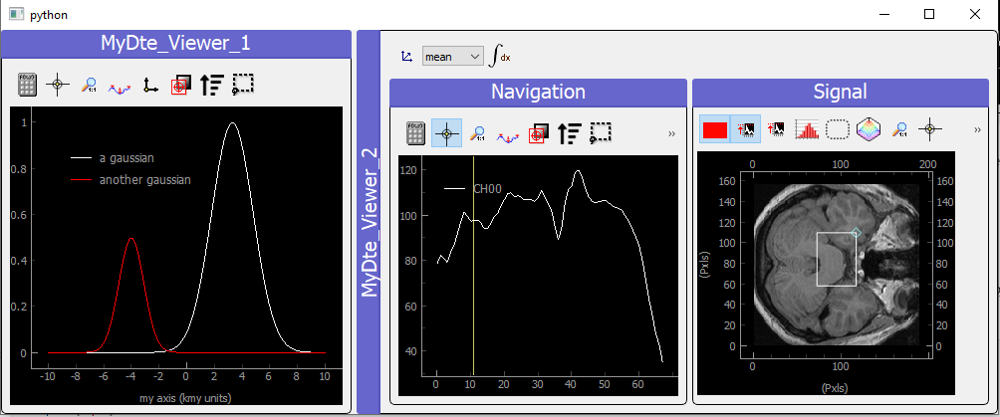

   Showing DataToExport on a ViewerDispatcher

Such an object is a ViewerDispatcher:

.. code:: ipython3

    from pymodaq.utils.plotting.data_viewers.viewer import ViewerDispatcher

It allows to generate on the fly `Docks` containing a data
viewers adapted to the particular dwa is contains. Such a dispatcher is
used by the `DAQ_Viewer` and the `DAQ_Scan` to display your data!

