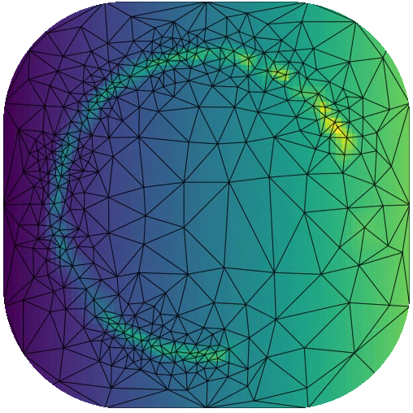
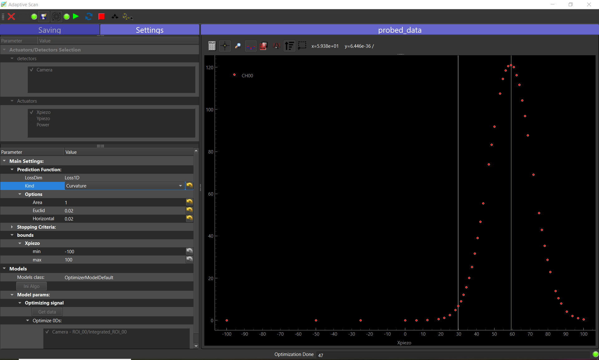
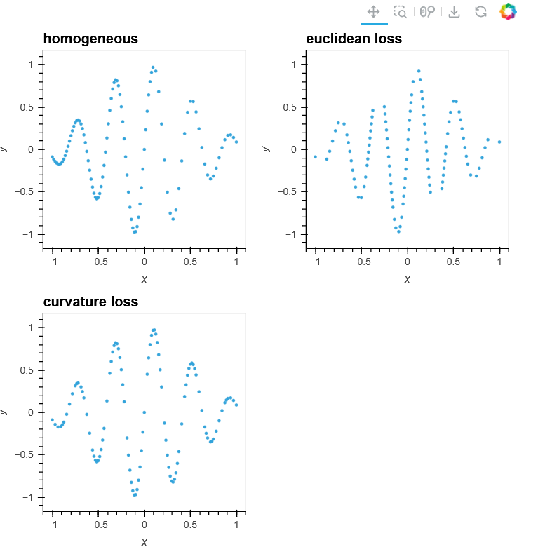

.. _adaptive_extension:

Adaptive Scanning
=================

First of all, this work is heavily supported by the work of Bas Nijholt and co-workers
through their python package:
`python-adaptive <https://github.com/python-adaptive/adaptive>`

   Taken from
   `Adaptive Tutorials <https://adaptive.readthedocs.io/en/latest/>`__.
   Sampling of a complex 2D function using adaptive!

Introduction
++++++++++++

*Adaptive is an open-source Python library that*
*streamlines adaptive parallel function evaluations. Rather than calculating all points on a dense grid, it*
*intelligently selects the "best" points in the parameter space based on your provided function and bounds.*
*With minimal code, you can perform evaluations on a computing cluster, display live plots, and optimize the adaptive*
*sampling algorithm.*

This, above, is a citation from the authors of the python-adaptive package. It is meant firstly to evaluate
complex functions in a "intelligent" subset of the parameter space. In the PyMoDAQ framework, we often
register data as a function of one or a few varying parameters. The :ref:`DAQ_Scan_module` allows this on a
predetermined grid that could be uniform or more complex but always predetermined. This means that we have to wait for
the end of the scan to know if the settings of the scan implied a good sampling of our parameter space to reveal regions
where our data variation is of interest. Adaptive scanning now allows a sampling being determined through learning of
previously probed parameters. The algorithm will sample finely the parameter space where the data vary quickly as a
function of the parameters, while it will only sample roughly where the signal is constant or just null.

Of course there are some limitations:

* The first one is to decide what *observable* will be used by the algorithm to
  perform the sampling learning. It has to be a 0D pymodaq data, either raw from a detector, calculated though a ROI or
  a more complex one using the :ref:`datamixer_extension`.
* The second is related to the fact that the parameter space will be probed kind of randomly where from
  one step to another, a scanned parameter value can vary a lot. This could be a problem if:

  *  the actuator driving this parameter has some kind of hysteresis or backlash
  *  the parameter variation is very slow. The gained time compared to a dense uniform sampling will not be much.

* Because the algorithm learns from variation of measurements, the results of a measurement of the *observable* should
  not be too noisy.

Figure :numref:`adaptive_running_gui_fig` displays the Adaptive GUI. Most of its features are similar to the
:ref:`bayesian_extension` extension (as they both inherit from the Optimizer set of base classes). See the
:ref:`bayesian_usage` for more details on how to init/use the extension.

.. _adaptive_running_gui_fig:

   User Interface of the Adaptive Optimization extension during a run, sampling non-linearly a 1D Gaussian shaped data.

The algorithm use a *loss* function to determine the next probed coordinates (actuators value). They are categorized
given the number of selected actuators: Loss1D, Loss2D, LossND with subtypes allowing to tune the algorithm. See figure
:numref:`adaptive_loss1D_fig` for the result of various Loss1D subtypes.

.. _adaptive_loss1D_fig:

   Taken from
   `Adaptive Tutorials <https://adaptive.readthedocs.io/en/latest/tutorial/tutorial.Learner1D/#looking-at-curvature>`__.
   Sampling of a sinus/exponential function using various 1D losses functions.

.. note::

  It is entirely possible and very easy to develop a custom loss function. PyMoDAQ uses a factory pattern
  to register new loss function and they can be added in the `pymodaq.extensions.adaptive.loss_function`
  module. See the `adaptive tutorials <https://adaptive.readthedocs.io/en/latest/tutorial/tutorial/>`__ for some
  exemples.

.. note::

  While the python-adpative package features parallel calculation/function evaluation, PyMoDAQ can only run a given
  detector in a single process (it doesn't make sense otherwise...) therefore no parallel computing is leveraged in this
  extension.

The Stopping criteria
*********************

By default the algorithm will stop after it reached the given number of iterations (*Niteration* setting).
But if you want to let it run indefinitely (or using a manual stop), you can use the *None* stop type.