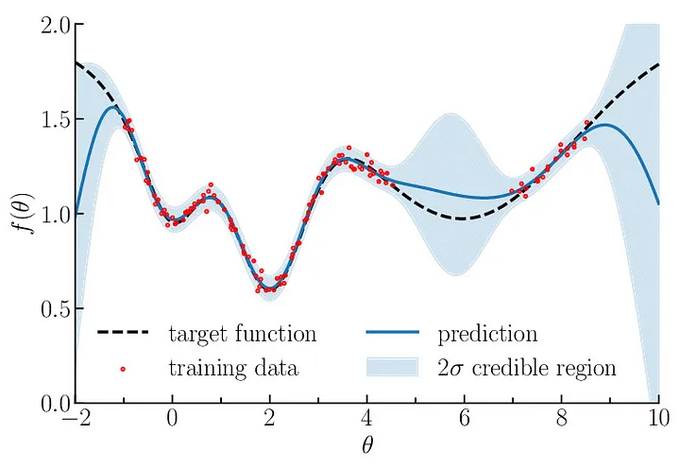
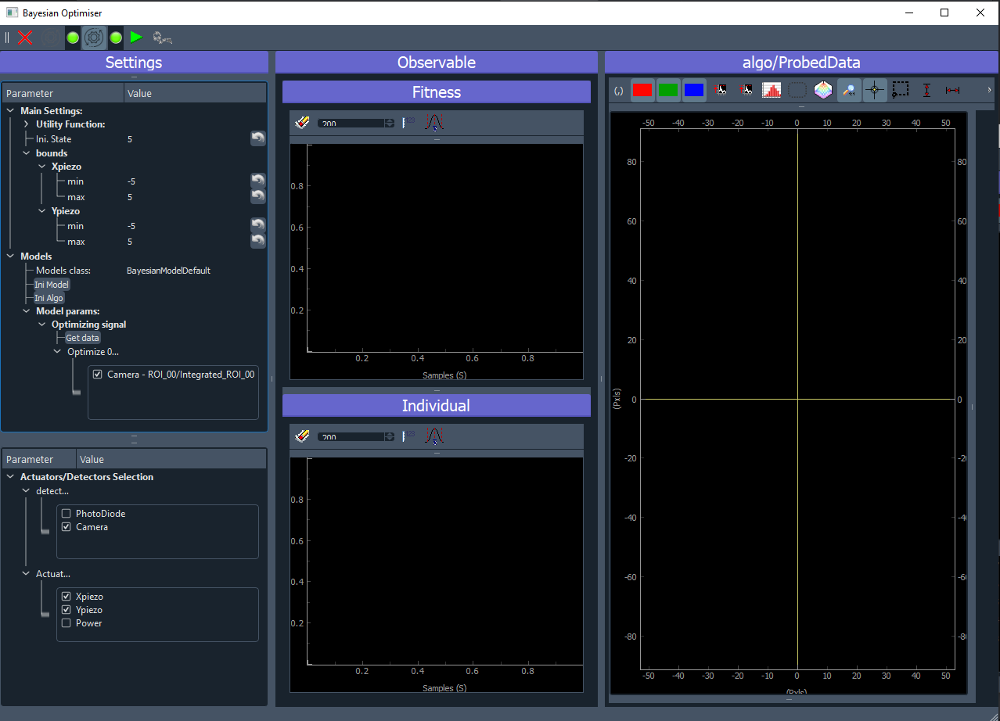
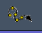
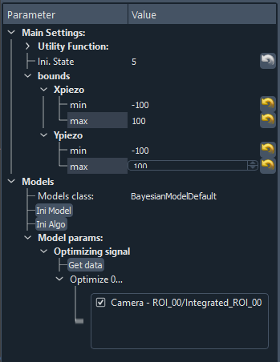
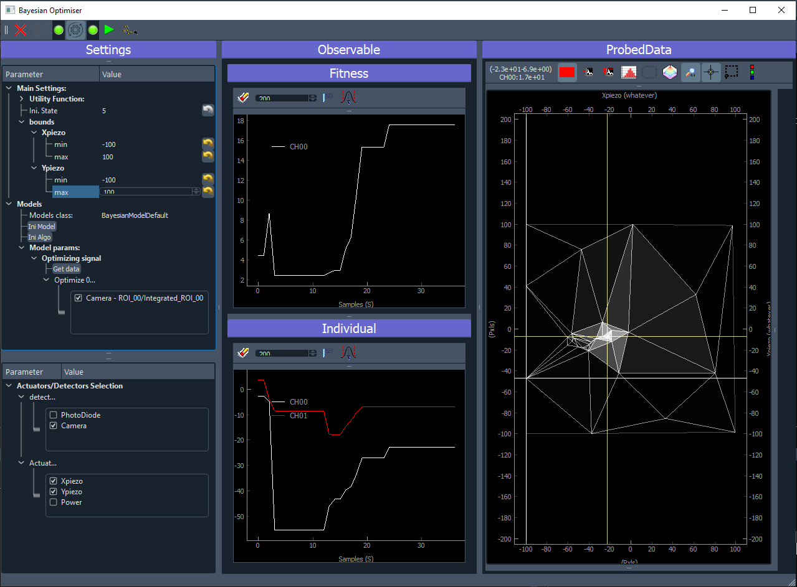
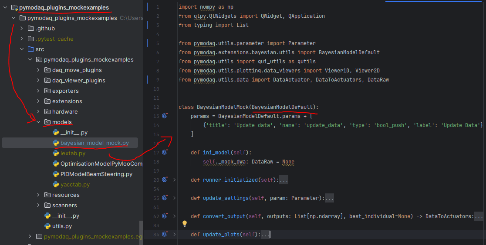

.. _bayesian_extension:

Bayesian Optimisation
=====================

First of all, this work is heavily supported by the work of Fernando Nogueira through its python package:
`bayesian-optimization <https://github.com/bayesian-optimization/BayesianOptimization>`__ and the underlying use
of Gaussian Process regression from `scikit-learn <https://scikit-learn.org/stable/modules/gaussian_process.html>`__.

Introduction
++++++++++++

You'll find below, a very short introduction, for a more detailed one, you can also read
`this article <https://medium.com/@okanyenigun/step-by-step-guide-to-bayesian-optimization-a-python-based-approach-3558985c6818>`__
from Okan Yenigun from which this introduction is derived.

Bayesian optimization is a technique used for the global optimization (finding an optimum) of black-box functions. Black box
functions are mathematical functions whose internal details are unknown. However given a set of input parameters,
one can evaluate the possibly noisy output of the function. In the PyMoDAQ ecosystem, such a black box would
often be the physical system of study and the physical observation we want to optimize given a certain number
of parameters. Two approaches are possible: do a grid search or random search using the ``DAQ_Scan`` extension that can
prove inefficient (you can miss the right points) and very lengthy in time or
do a more intelligent phase space search by building a probabilistic surrogate model of our black box by using the
history of tested parameters.

Gaussian Processes:
-------------------
The surrogate model we use here is called Gaussian Process, GP. A Gaussian process defines a distribution
of functions potentially fitting the data. This finite set of function values follows a multivariate Gaussian
distribution. In the context of Bayesian optimization, a GP is used to model the unknown objective function,
and it provides a posterior distribution over the function values given the observed data.

   Illustration of Gaussian process regression in one dimension. Gaussian processes are specified by an
   estimation function and the uncertainty function evolving constantly as more and more *points* are being tested.
   `Source <https://www.researchgate.net/publication/327613136_Bayesian_optimization_for_likelihood-free_cosmological_inference>`__

From this distribution, a mean value (`µ`) and standard deviation (`std`) of the function distribution is computed. These are then used
to model our black box system. To go one step beyond, the algorithm should predict which parameters should be probed
next to optimize the mean and std. For this we'll construct a simple function based on the probability output of the GP:
the acquisition function.

.. note::
  GPs are themselves based on various kernels (or covariance matrix or *function generator*). Which kernel to use
  may depend on your particular problem, even if the standard ones (as provided in PyMoDAQ) should just work fine.
  If you want to know more on this just browse this `thesis <https://www.cs.toronto.edu/~duvenaud/thesis.pdf>`__.

Acquisition function:
---------------------

Choosing which point to probe next is the essential step in optimizing our black box. It should quantify the utility of the
next point either to directly optimize our problem or to increase the fitness of the model. Should it favor the
exploration of the input parameters phase space? Should it perform exploitation of the known points to find the optimum?

All acquisition function will allow one or the other of these, or propose an hyperparameter to change the behaviour
during the process of optimisation. Among the possibilities, you'll find:

* The Expected Improvement function (EI)
* The Upper Confidence Bound function (UCB)
* The Probability of Improvement function (PI)
* ...

You can find details and implementation of each in `here <https://medium.com/@okanyenigun/step-by-step-guide-to-bayesian-optimization-a-python-based-approach-3558985c6818>`__.
PyMoDAQ uses by default the Upper Confidence Bound function together with its `kappa` hyperparameter,
see :ref:`bayesian_settings` and `here <http://bayesian-optimization.github.io/BayesianOptimization/exploitation_vs_exploration.html>`__.

.. note::

  You can find a notebook illustrating the whole optimisation process on PyMoDAQ's Github:
  `here <https://github.com/PyMoDAQ/notebooks/blob/main/notebooks/gaussian_process.ipynb>`__, where you can
  define your black box function (that in general you don't know) and play with kernels and utility functions.

Usage
+++++

:numref:`bayesian_gui_fig` shows the GUI of the Bayesian Optimisation extension. It consists of three panels:

* Settings (left): allow configuration of the model, the search bounds, the acquisition function, selection of which
  detector and actuators will `participate` to the optimisation.
* Observable (middle): here will be plotted the evolution of the result of the optimisation. On the top, the best
  reached target value will be plotted. On the bottom, the coordinates (value) of the input parameters that gave the
  best reached target will be plotted.
* Probed Data: this is a live plotter of the history of tested input parameters and reached target

.. _bayesian_gui_fig:

   User Interface of the Bayesian Optimization extension.

Toolbar:
--------

-  |quit|: quit the extension
-  |ini|: Initialise the selected model
-  |ini|: Initialise the Bayesian algorithm with given settings
-  |run|: Run the Bayesian algorithm
-  |goto|: Move the selected actuators to the values given by the best target reached by the algorithm

.. _bayesian_settings:

Settings
--------

1. Actuators and detectors

First of all, you'll have to select the detectors and actuators that will be used by the algorithm,
see :numref:`bayesian_gui_act_sett_fig`.

.. _bayesian_gui_act_sett_fig:

.. figure:: bayesian_data/gui_act_sett.png
   :alt: GUI

   Zoom on the settings of the GUI for selection of the detectors and actuators to be used in the optimization.

2. Model selection

Then you have to select a `model` (see :numref:`bayesian_gui_settings_fig` and :ref:`bayesian_model`)
allowing the customization of the extension with respect of what is the
signal to be optimized, which particular plot should be added... . If the signal
to be optimized is just one of the 0D data generated by one of the selected detector, then the
`BayesianModelDefault` is enough and no model programming is needed. If not, read :ref:`bayesian_model`.
In the case of the `BayesianModelDefault`, you'll have to select a 0D signal to be used as the target to be optimized,
see bottom of :numref:`bayesian_gui_settings_fig`.

3. Algorithm parameters

Then, you'll have to specify the number of initial random state. This number means that before running a fit using the GPs,
the first N iteration will be made using a random choice of input parameters among the considered bounds. This allows for
a better initial exploration of the algorithm.

.. _bayesian_gui_settings_fig:

   Zoom on the settings of the GUI.

The value of the bounds is a crucial parameter. You have to enter the limits (min/max) for each selected actuator. The
algorithm will then optimize the signal on this specified phase space.

Then you can run the algorithm, |run| button, and see what happens...

.. note::
  Some parameters of the algorithm can be changed on the fly while the algorithm is running. This is the case for:

  * the bounds
  * the utility function hyper parameters

Observable and Probed Data
--------------------------

Once you run the algorithm, the plots will be updated at each loop. The observable will update the current best
reached target value (fitness) and corresponding values of the actuators (input parameters). The right panel
will plot all the collected targets at their respective actuators value. In the case of a 2D optimisation, it
will look like on figure :numref:`bayesian_running_gui_fig`. The white crosshair shows the current tested target while
the yellow crosshair shows the best reached value.

.. _bayesian_running_gui_fig:

   User Interface of the Bayesian Optimization extension during a run.

Once you stop the algorithm (pause it in fact), the |goto| button will be enabled allowing to move the actuators
to the best reached target values ending the work of the algorithm. If you want you can also restart it. If you press
the |run| button, the algorithm will begin where it stops just before. It you want to reinitialize it, then press the
|ini| button twice (eventually changing some parameters in between).

.. _bayesian_model:

Models
------

In case the default model is not enough. It could be because what you want to optimize is a particular mathematical treatment
of some data, or the interplay of different data (like the ratio of two regions of interest) or whatever complex
thing you want to do.

In that case, you'll have to create a new Bayesian model. To do so, you'll have to:

1. create a python script
2. place it inside the models folder of a PyMoDAQ plugin (it could be a plugin you use with custom instruments, or you
   could devote a plugin just for holding your models: PID, Optimization... In that case, no need to publish it on pypi.
   Just hosting it locally (and backed up on github/gitlab) will do. You'll find an example of such a Model in the
   `pymodaq_plugins_mockexamples`
3. create a class (your model) with a name in the form BayesianModelXXX (replace XXX by what you want). This class
   should inherit a base model class either `BayesianModelDefault` or `BayesianModelGeneric` to properly work and be
   recognized by the extension.
4. Re-implement any method, property you need. In general it will be the ``convert_input`` one. This method receive
   as a parameter a DataToExport object containing all the data acquired by all selected detectors and should return
   a float: the target value to be optimized. For more details on the methods to be implemented, see :ref:`bayesian_api`.

.. _bayesian_model_fig:

   Example of a custom Bayesian model.
