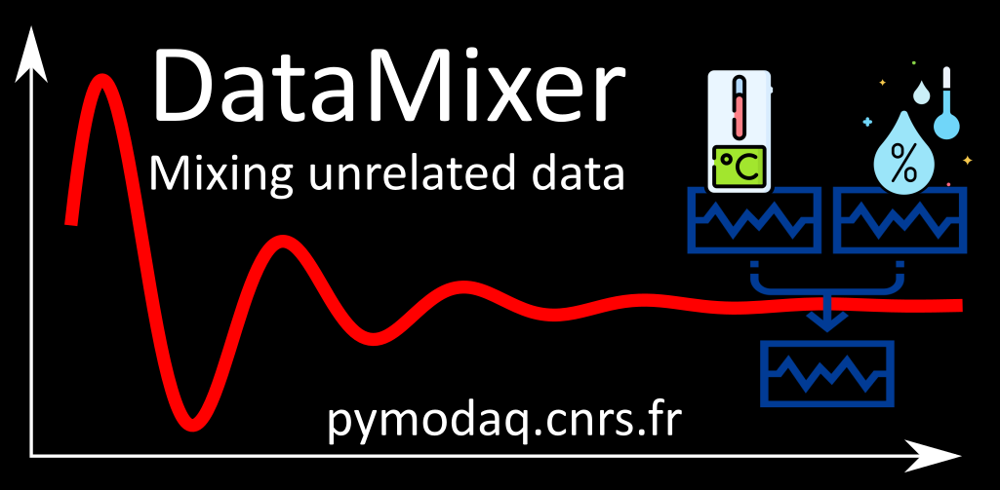
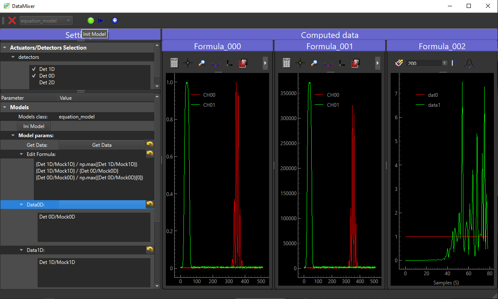

.. _datamixer_extension:

DataMixer
=========

   The DataMixer extension allowing to mix/process unrelated data to be used as a brand new source of data!

Introduction
++++++++++++

When dealing with PyMoDAQ you may be frustrated because you cannot easily customize the behaviour of the modules. In
particular the DAQ_Viewer module grab raw data and except by the use of regions of interest you cannot really
post-process those data. In fact there are solutions but they are quite complex especially if one want to do regular
and often varying post-processing. These solutions are:

* to create another plugin inheriting from the standard one and doing the post-processing in the reimplemented
  `grab_data` method. Here you can process the data from only one detector module and you don't have access to
  the regions of interest
* create an extension to perform the post-processing by capturing all the exported data from the Dashboard. But then
  you cannot use that to plot live data during a scan.

Those solutions both have limitations, those are what the DataMixer will solve!

The DataMixer allows you to:

* do operations between unrelated data (that is from various detectors), either raw or from ROI or more generally
  post-process the generated data from the DashBoard
* emulates a virtual DAQ_Viewer module that seems to grab data out of the DataMixer, hence allowing those processed
  data to be used in any DashBoard extension, for instance the DAQ_Scan!

Usage
+++++

The models or how to tailor the post-processing
-----------------------------------------------

Models are classes allowing to customize the post-processing. They have been introduced quite a long time ago by the
:ref:`PID_module` and are heavily used by the optimizing :ref:`Bayesian <bayesian_extension>` and
:ref:`Adaptive <adaptive_extension>` modules. They are therefore also used in the DataMixer to perform custom tasks.
But they are still python classes one has to write for each postprocessing one want to try. They are therefore okay if
you're going to often use them or if they are general enough to be used in various situations. The tow models shipped
with the extension are of the last kind. The first is the Gaussian fit model allowing to fit 1D data by Gaussians.
The second allows you to define in a text box the mathematical expressions you
want to perform between you raw data, see :ref:`equation_model`.

.. _equation_model:

The Equation Model
------------------

.. _equation_model_fig:

   The DataMixer GUI with the initialized Equation model!

Figure :numref:`equation_model_fig` shows the DataMixer GUI after the equation model has been initialized. The left
panel is for the settings while the right one displays processed data. You first have to select your model (its specific
settings will be displayed when chosen) and initialize it. Then you can select the detectors (from the DashBoard) whose
data you want to use in the post-processing. All the available DataWithAxes (dwa)  generated PyMoDAQ
data will be displayed in the settings (either raw or from ROI) once you press the ``Get Data`` button.
You can then copy/paste them in the
``Edit Formula`` area. You'll have to write them between curly brackets for the parser to interpret them as the full dwa
object. Dwa can handle operations between them such as regular addition, substraction... but are also compatible with
most of the numpy functions such as ``np.sum``, ``np.abs``, ... If you find an error while trying to use a numpy
function, it's probably because it is not yet possible to use it, open an issue and it will be done! Finally each
line/operation in the edit area, will be interpreted as a Dwa and every time you press the snap button the resulting dwa
will be plotted in dedicated viewer panel (they are three of them in the case of figure :numref:`equation_model_fig`.

The Gaussian fit model
----------------------

The Gaussian fit model is a bit more simple, it will try to fit every 1D data you selected... It's more of an example
of a custom model than a versatile one...

Emulating a virtual detector
++++++++++++++++++++++++++++

Alright you performed the super, crazy, Nobel prize winning post-processing, so what? The next step is to create a
virtual detector in the Dashboard generating data from the DataMixer extension. Because those post-processed data now
will seem to come from the DashBoard, all the other extensions will be able to use it. With the DAQ_scan you could
now look at live post-process data while scanning!!! For this to happen just press the |plus| button and a new
DAQ_Viewer will appear in the Dashboard!!

Example of code for a Model
+++++++++++++++++++++++++++

.. code-block::

    class DataMixerModelEquation(DataMixerModel):
        params = [
            {'title': 'Get Data:', 'name': 'get_data', 'type': 'bool_push', 'value': False,
             'label': 'Get Data'},
            {'title': 'Edit Formula:', 'name': 'edit_formula', 'type': 'text', 'value': ''},
            ...
        ]

        def ini_model(self):
            self.model_saver_loader = ConfigSaverLoader(self.settings, self.data_mixer.datamixer_config,
                                                        base_path=[self.__class__.__name__])
            self.show_data_list()
            self.model_saver_loader.load_config()

        def update_settings(self, param: Parameter):
            if param.name() == 'get_data':
                self.show_data_list()
            elif param.name() == 'edit_formula':
                self.model_saver_loader.save_config(param)

        def process_dte(self, dte: DataToExport):
            formulae = split_formulae(self.get_formulae())
            dte_processed = DataToExport('Computed')
            for ind, formula in enumerate(formulae):
                try:
                    dwa = self.compute_formula(formula, dte,
                                               name=f'Formula_{ind:03.0f}')
                    dte_processed.append(dwa)
                except Exception as e:
                    logger.exception(f'{str(e)}')
            return dte_processed

        def get_formulae(self) -> str:
            """ Read the content of the formula QTextEdit widget"""
            return self.settings['edit_formula']

        def show_data_list(self):
            ...

        def compute_formula(self, formula: str, dte: DataToExport,
                            name: str) -> DataWithAxes:
            """ Compute the operations in formula using data stored in dte

            Parameters
            ----------
            formula: str
                The mathematical formula using numpy and data fullnames within curly brackets
            dte: DataToExport
            name: str
                The name to give to the produced DataWithAxes

            Returns
            -------
            DataWithAxes: the results of the formula computation
            """
            formula_to_eval, names = replace_names_in_formula(formula)
            dwa = eval(formula_to_eval)
            dwa.name = name
            return dwa

As you see, to be valid (and seen by PyMoDAQ), the model should inherit the ``DataMixerModel`` base class defining
internal mechanisms but also exposing the interface and the methods you have to reimplement:

* ``ini_model``: will be called after you clicked the ini model button. Place here whatever should be done. Here one
  create a ConfigSaverLoader that will cache and load the last formula you entered. Data will also be probed from the
  selected detector (if any)
* ``update_settings``: will be called whenever you change one of the model settings.
* ``process_dte``: will be called whenever you press the snap button.

.. note::

  For a model to be "seen" by PyMoDAQ either place it in the ``pymodaq.extensions.data_mixer.models`` module or any
  models module/folder of a PyMoDAQ plugin.