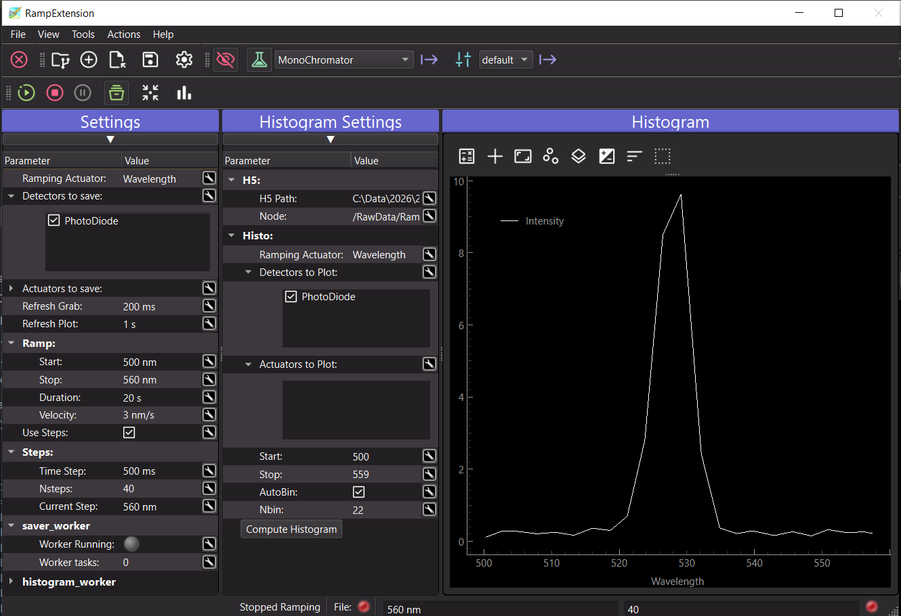
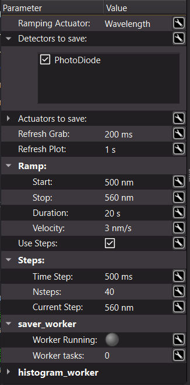
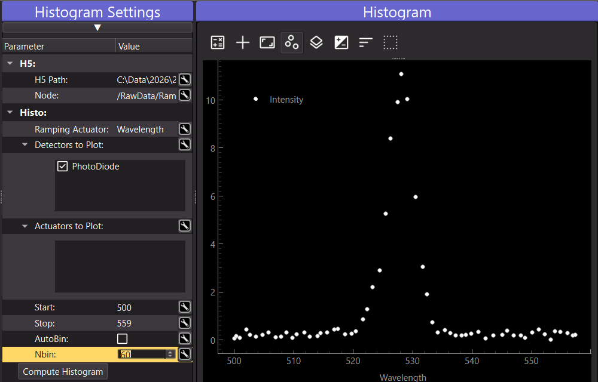

.. _ramping_extension:

Ramping
=======

.. _ramping_main_fig:

   The Ramping extension during a ramp: settings (left), histogram settings and live histogram (right).

Introduction
++++++++++++

.. include:: ../../../packages/pymodaq/src/pymodaq/extensions/ramping/help.md
   :parser: myst_parser.sphinx_
   :start-line: 2
   :end-before: <!-- end of intro -->

The Ramping extension is made for **fast and live acquisition**, as opposed to the :ref:`DAQ_Scan_module` that
moves an actuator step by step and acquires data once it has reached each position:

* *fast*: the actuator never stops and the acquisition never waits for it. Each module is acquired continuously, at
  its own rate, as fast as the hardware (and the *Refresh Grab* setting) allows. Where a scan gives one point per
  position, a ramp gives as many points as the detectors can produce during its duration, with no dead time spent
  waiting for the moves to be done
* *live*: the data are displayed in the viewers of the modules while being acquired, and the result of the ramp
  (the data as a function of the ramped value) is computed and plotted *during* the ramp, so you can follow the
  experiment and stop it as soon as you have seen what you were looking for

Everything is logged with time stamps in a h5 file, as the :ref:`DAQ_Logger <DAQ_Logger_module>` does. As the data are
acquired asynchronously, the extension *rebuilds* the data as a function of the ramping actuator value by binning them
in time and averaging them: this is the **histogram**, plotted live during the ramp and that can be recomputed later
from the saved file.

Launching the Ramping extension
+++++++++++++++++++++++++++++++

Like the other extensions, the Ramping extension is started from the *Extensions* menu of the :ref:`Dashboard_module`
(entry **Ramping**). It then acts on the actuators and detectors declared in the Dashboard.

It can also be started on its own using the ``ramping`` command (installed with PyMoDAQ), or by running the
``ramping.py`` module. A Dashboard is created under the hood, then select and apply an experiment using the Dashboard
toolbar of the extension (see :ref:`dashboard_external_toolbar`):

.. code-block:: bash

   ramping
   # or
   python -m pymodaq.extensions.ramping.ramping

.. note::

   The ramping actuator and the modules to record are chosen among the modules of the Dashboard: an
   :ref:`Experiment <experiment_manager>` must be applied before the workflow actions (Start, Stop, Pause, Log) and
   the *Init Positions* action are enabled.

The User Interface
++++++++++++++++++

The main window (see :numref:`ramping_main_fig`) is made of:

* the toolbar, described below
* the **Settings** dock, to configure the ramp and the modules to record, see :ref:`ramping_settings`
* the **Histogram Settings** and **Histogram** docks, see :ref:`ramping_histogram`. They are only shown when the
  *Log* action is checked
* a hidden **Saving** dock with the settings of the h5 file, shown using the *Show h5 settings* action of the file
  toolbar
* the status bar, see :ref:`ramping_status_bar`

Toolbar
-------

The toolbar contains:

* the h5 file actions, to select or create the h5 file where data will be logged, to show the saving settings and to
  open an existing file. They are provided by the :ref:`h5manager` shared by many extensions. In this extension, the
  *Open file* action opens the file in *read* mode, to compute the histogram of a previous ramp, see
  :ref:`ramping_offline_analysis`
* the Dashboard toolbar, to show/hide the Dashboard and to select and apply experiments and states, see
  :ref:`dashboard_external_toolbar`
* the workflow actions:

  * **Start**: moves the ramping actuator to the *Start* value, waits for the move to be done, then starts the
    acquisition of the modules and the ramp itself, see :ref:`ramping_workflow`
  * **Stop**: stops the ramp and the acquisition. The ramping actuator stays where it is
  * **Pause**: pauses/resumes the ramp
  * **Log**: if checked when starting, all data are logged in the h5 file and the live histogram is displayed, see
    :ref:`ramping_logging`. Checking/unchecking it also shows/hides the histogram docks

* **Init Positions**: moves the ramping actuator to the *Start* value of the ramp, for instance to prepare the
  setup before starting, or to go back after a ramp
* **Update Histogram**: recomputes the histogram using the current histogram settings. It is enabled once a ramp has
  been started or a file has been loaded

.. _ramping_settings:

Settings
--------

.. _ramping_settings_fig:

   The settings of the Ramping extension.

The settings (:numref:`ramping_settings_fig`) are:

* **Ramping Actuator**: the actuator of the Dashboard to be ramped. The units of the ramp values are the ones of this
  actuator
* **Detectors to save**: the detectors to be grabbed and logged during the ramp
* **Actuators to save**: other actuators whose values are polled and logged during the ramp (the ramping actuator is
  not listed here, its value is always recorded). For instance the sample temperature measured by a sensor declared
  as an actuator while the heater power is ramped
* **Refresh Grab**: the period at which the data are acquired during the ramp. It is used to set the *Wait time*
  of the selected detectors (time between two grabs in continuous mode) and the *refresh timeout* of the selected
  actuators and of the ramping actuator (period at which their current value is polled)
* **Refresh Plot**: the period at which the live histogram is recomputed and displayed
* **Ramp**:

  * **Start** / **Stop**: the initial and final values of the ramping actuator. *Stop* may be lower than *Start*
    to ramp down
  * **Duration**: the time to go from *Start* to *Stop*
  * **Velocity**: the corresponding ramp speed, in actuator units per duration units

  Only one of *Duration* and *Velocity* is editable, the other one is computed from it, *Start* and *Stop*. By
  default the *Duration* is set by the user. This, as well as the units of the duration, is set in the configuration
  file, see :ref:`ramping_configuration`

* **Use Steps**: how the ramp is applied to the actuator, see :ref:`ramping_workflow`:

  * checked: the extension computes the ramp itself and sends a new target value to the actuator every *Time Step*
  * unchecked: the extension sends a single move to the *Stop* value and lets the hardware ramp at its own speed

* **Steps** (only displayed if *Use Steps* is checked):

  * **Time Step**: the time between two successive target values sent to the actuator
  * **Nsteps**: the resulting number of steps (*Duration* / *Time Step*), read only
  * **Current Step**: the current target value of the ramp, updated while ramping

* **saver_worker** and **histogram_worker**: read-only status of the threads saving the data and computing the
  histogram: running or not and number of pending tasks

.. _ramping_status_bar:

Status bar
----------

The status bar displays, from left to right:

* a message giving the current status of the extension: *Moving to Init value*, *Started Ramping*, *Stopped
  Ramping*...
* the indicators of the :ref:`h5manager`: the h5 file currently used and its status
* the current target value of the ramp (in the units of the ramping actuator)
* the total number of steps of the ramp (1 when *Use Steps* is unchecked)
* a LED, green while ramping, red otherwise

.. _ramping_workflow:

Running a ramp
++++++++++++++

When **Start** is triggered, the extension:

#. moves the ramping actuator to the *Start* value and waits for it to be reached
#. applies the *Refresh Grab* period to the selected modules and, if *Log* is checked, creates a new node in the h5
   file (see :ref:`ramping_logging`)
#. starts the continuous grab of the selected detectors and the continuous polling of the current values of the
   ramping actuator and of the selected actuators
#. starts the ramp, then stops everything once the *Duration* has elapsed

The ramp itself depends on the *Use Steps* setting:

* **with steps**: every *Time Step*, the target value is computed from the time elapsed since the start of the ramp,
  ``value = start + (stop - start) * elapsed_time / duration``, and sent to the ramping actuator as an
  absolute move. As the target value depends on the actual elapsed time, the ramp stays on schedule even if a step is
  delayed. The actuator moves are not waited for: choose a *Time Step* compatible with the time your hardware needs
  to apply a new value. This mode works with any actuator
* **without steps**: a single absolute move to the *Stop* value is sent at the beginning and the hardware is expected
  to ramp by itself, for instance a temperature controller or a power supply with a configurable ramp rate. The speed
  of the ramp is then the one of the hardware: make sure it is consistent with the *Duration* of the extension, as
  the acquisition is stopped once this duration has elapsed

**Pause** stops sending new target values and stops logging the data. When resuming, the ramp goes on from where it
was paused: the time spent in pause is not taken into account. Without steps, the hardware is not paused and keeps on
ramping.

**Stop** stops the ramp and the acquisition at any time. The data still waiting to be saved are written to the file
before it is closed (see the *saver_worker* status in the settings): the extension cannot be closed until this is
done.

.. _ramping_parametrization:

Choosing the ramp parameters
++++++++++++++++++++++++++++

The extension doesn't know what your hardware can do: it computes target values on a time schedule and sends them,
without waiting for the actuator. The settings must therefore be chosen according to the capabilities of the
actuator, mostly its **maximum velocity** (and acceleration), and of the detectors, mostly their acquisition rate.

The ramp velocity
-----------------

The velocity of the ramp, ``(Stop - Start) / Duration`` (displayed in the *Velocity* setting), must be **lower than
the maximum velocity of the actuator**, with some margin to account for its acceleration and for the time needed to
process each command. If it is not the case, the actuator lags behind the ramp: when the *Duration* has elapsed, the
acquisition stops while the actuator has not reached the *Stop* value yet. In other words, the minimum duration of a
ramp is ``(Stop - Start) / max velocity``.

Setting ``ramp_setting = [ "velocity", "duration",]`` in the configuration (see :ref:`ramping_configuration`) is
convenient here: you directly enter a velocity compatible with your hardware, and the duration is computed.

The time step
-------------

With *Use Steps* checked, the actuator moves by ``Velocity * Time Step`` at each step. A new target is sent every
*Time Step*, whether or not the previous one has been reached, so:

* the *Time Step* should be **longer than the time the actuator needs to perform one step**, ``Velocity * Time Step /
  max velocity`` plus the communication and settling times of the hardware. Otherwise the targets pile up in the
  actuator thread and the actuator lags behind
* the *Time Step* should be **short enough** for the ramp to look continuous at the scale of your experiment: with a
  long time step, the actuator moves by large increments and stays still in between, the ramp becomes a staircase
* the steps cannot be smaller than the resolution of the actuator (or of the controller setpoint): the *Time Step*
  should be at least ``resolution / Velocity``

Without steps, these questions are handled by the hardware itself, which is often the best option when the controller
has a built-in ramp: the setpoint of a temperature controller, the ramp rate of a power supply, the velocity of a
motion controller... The *Duration* of the extension should then match the time the hardware takes to go from *Start*
to *Stop* at its own speed, a little longer to be safe: any extra time just records the end of the ramp, while a too
short duration stops the acquisition before the end.

The acquisition rate
--------------------

During the ramp, a detector acquiring every ``T`` seconds (its acquisition time or the *Refresh Grab* period,
whichever is longer) gives a point every ``Velocity * T`` in actuator units. This is the **sampling of your data
along the ramp**: to resolve a feature of width ``w`` (a resonance, a phase transition...), you need several points
within it, that is ``Velocity * T << w``. If not, slow down the ramp (longer duration) or speed up the acquisition.

Likewise, as the actuator keeps moving while a detector integrates, each data point is averaged over
``Velocity * integration time``: this blurring must stay below the resolution you are looking for.

The same goes for the values of the ramping actuator itself: they are polled every *Refresh Grab*, and the histogram
can only be as precise as these values. Its *Nbin* setting should be consistent with the number of points actually
acquired, see :ref:`ramping_histogram`.

A worked example
----------------

You want to record a signal as a function of the position of a stage moving from 0 to 20 mm, whose maximum velocity
is 5 mm/s, with a detector acquiring at 50 Hz:

* the minimum duration is 20 / 5 = 4 s. Choosing 10 s (2 mm/s) leaves a comfortable margin for accelerations
* with a *Time Step* of 100 ms, the stage moves by 0.2 mm at each of the 100 steps, which takes 40 ms at full speed:
  the stage has the time to complete each step before the next one
* with a *Refresh Grab* of 20 ms, the detector gives a point every 2 mm/s × 20 ms = 40 µm, that is about 500 points
  over the ramp. As the stage moves by 0.2 mm steps, the histogram should not use more than 100 bins (one per step):
  more bins would only resolve the staircase. To get a finer result, reduce the *Time Step*, or use the built-in
  velocity of the controller (*Use Steps* unchecked)

.. tip::

   Even when the actuator lags behind the ramp, the histogram stays correct: its x axis is computed from the values
   *actually logged* for the ramping actuator, not from the targets sent by the extension. A lagging actuator only
   reduces the range actually covered. The same is true when the ramped quantity is not exactly the one you control,
   for instance the setpoint of a heater versus the temperature of the sample: log the sensor as one of the *Actuators
   to save* and select it as the *Ramping Actuator* of the histogram.

.. _ramping_logging:

Data logging
++++++++++++

If the **Log** action is checked when the ramp is started, all the data acquired during the ramp are saved in the h5
file selected using the file toolbar, or automatically created using the standard naming convention, see
:ref:`h5manager`:

* the data of the selected detectors, at each grab
* the values of the ramping actuator and of the selected actuators, at each polling

Each ramp creates a new node in the h5 file, named ``Ramp000``, ``Ramp001``... under the ``RawData`` group. The
settings of the extension are saved as attributes of this node, so that the parameters of the ramp can be retrieved
later. Under this node, each control module has its own node where its data are saved with their time stamps, as done
by the :ref:`DAQ_Logger <DAQ_Logger_module>`: detectors and actuators are acquired asynchronously, each one at its own
rate. The resulting file can be explored with the :ref:`H5Browser_module`.

.. code-block:: text

   Dataset_20261003_000.h5
   └── RawData
       ├── Ramp000                  first ramp
       │   ├── Actuator000          the ramping actuator (values + time stamps)
       │   ├── Actuator001          another selected actuator
       │   ├── Detector000          a selected detector (its data + time stamps)
       │   └── ...
       └── Ramp001                  second ramp
           └── ...

If *Log* is not checked, the ramp is applied and the modules are acquired (their data are displayed in their own
viewers), but nothing is saved and no histogram is computed.

.. _ramping_histogram:

The histogram
+++++++++++++

The logged data are a set of independent time series: the values of the ramping actuator on one side, the data of
each detector or actuator on the other side, each with their own time stamps. What you are generally interested in is
the data as a function of the ramping actuator value, for instance a signal as a function of the temperature. The
histogram computes it:

#. the time window is restricted to the part of the ramp where the ramping actuator goes from the histogram *Start*
   to *Stop* values
#. this time window is divided into bins. Their number is either set by the user (*Nbin*) or estimated automatically
   from the data (*AutoBin*)
#. in each time bin, the values of the ramping actuator are averaged, as well as the data of each other module. Empty
   bins are discarded

The result is displayed in the **Histogram** dock: each logged data is plotted as a function of the averaged ramping
actuator value. 0D data (a value at each time) are displayed as curves, higher dimensionality data keep their signal
axes, for instance a spectrum acquired during the ramp is displayed as a 2D map (ramping actuator value vs.
wavelength).

.. _ramping_histogram_fig:

   The histogram settings and the resulting data plotted as a function of the ramping actuator value.

The **Histogram Settings** (:numref:`ramping_histogram_fig`) are:

* **H5** group:

  * **H5 Path**: the h5 file the data are read from (read only)
  * **Node**: the ramp node (``Ramp000``, ``Ramp001``...) to process

* **Histo** group:

  * **Ramping Actuator**: the actuator used as the x axis of the histogram, by default the ramping actuator. Any other
    logged actuator can be selected, for instance a temperature sensor giving the actual temperature while the
    setpoint of the heater was ramped
  * **Detectors to Plot** / **Actuators to Plot**: the logged modules to be displayed as a function of the ramping
    actuator
  * **Start** / **Stop**: the range of the ramping actuator values to process, limited to the values actually logged
  * **AutoBin**: if checked, the number of bins is estimated from the data
  * **Nbin**: the number of bins, editable when *AutoBin* is unchecked. Increasing it gives more points but a noisier
    average

* **Compute Histogram**: recomputes the histogram. Changing any of the settings above does it as well

Live histogram
--------------

During a logged ramp, the histogram of the current ramp node is recomputed every *Refresh Plot* period from the data
already written in the file. The h5 file being opened in SWMR mode (Single Writer Multiple Readers), the data can be
read while they are being saved, see :ref:`h5manager`.

While ramping, the *Node*, *Ramping Actuator*, *Start* and *Stop* settings are locked to the current ramp. The
*Detectors to Plot* / *Actuators to Plot* selections and the binning (*AutoBin*, *Nbin*) can still be changed: they
are used at the next refresh of the live histogram. The modules to plot are chosen among the saved ones, and your
selection is kept from one ramp to the next (modules saved for the first time are selected by default).

.. _ramping_offline_analysis:

Offline analysis
----------------

Once the ramp is over and all the data have been saved, the file is reopened in read mode and the histogram settings
are enabled again: the bins, the range or the modules to plot can be changed to refine the result.

The histogram of a previous ramp can also be computed by opening its h5 file using the *Open file* action of the file
toolbar. The *Node* list is then filled with the ramp nodes of the file (the last one is selected), the lists of
actuators and detectors with the modules having logged data, and the histogram is computed.

.. _ramping_configuration:

Configuration
+++++++++++++

A few defaults are set in the ``[ramping]`` section of the PyMoDAQ configuration file (see :ref:`configfile`):

.. code-block:: toml

   [ramping]
   duration_units = [ "s", "min",]
   ramp_setting = [ "duration", "velocity",]

For both entries, the **first element** of the list is the one used, the other one being the other possible choice:

* ``duration_units``: the units of the *Duration* setting, and of the time part of the *Velocity* units. Use
  ``[ "min", "s",]`` for long ramps
* ``ramp_setting``: which of *Duration* or *Velocity* is set by the user, the other one being computed. Use
  ``[ "velocity", "duration",]`` to enter the ramp speed directly

The extension has to be restarted for changes to be taken into account.
