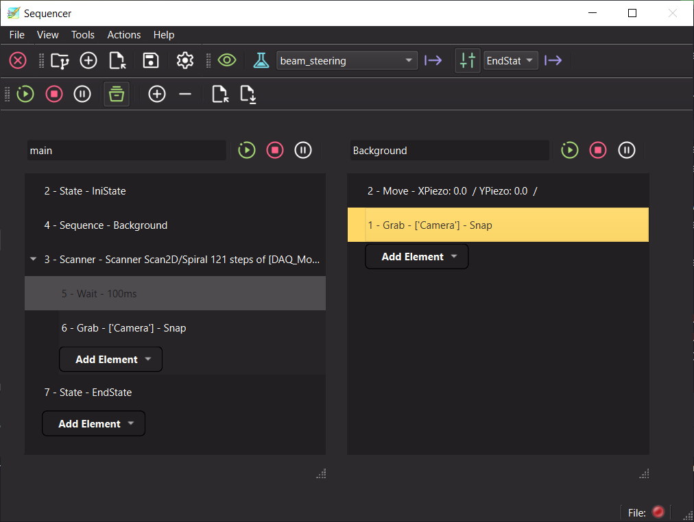
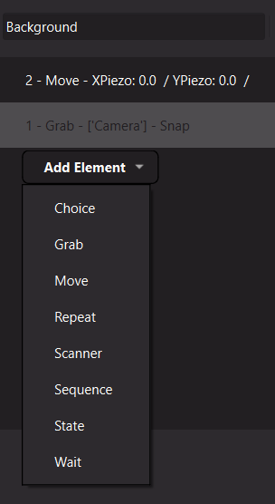
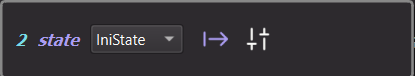
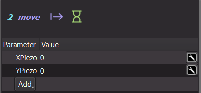
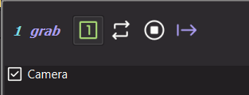
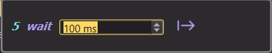
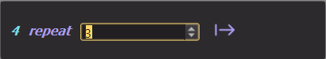
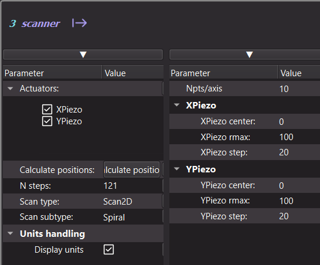
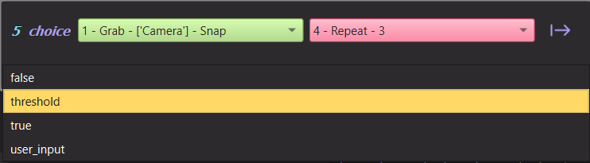
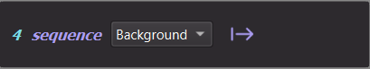

.. _sequencer_extension:

Sequencer
=========

.. _sequencer_main_fig:

   The Sequencer extension with two sequences: the *main* one (left) calling a second one (right).

Introduction
++++++++++++

.. include:: ../../../packages/pymodaq/src/pymodaq/extensions/sequencer/help.md
   :parser: myst_parser.sphinx_
   :start-line: 2
   :end-before: <!-- end of intro -->

The :ref:`DAQ_Scan_module` is perfect when you want to acquire data on a regular grid of actuators positions. But an
experiment is often more of a *procedure*: move some stages to a starting point, wait for a temperature to settle,
take a few snapshots, check a signal level and, depending on its value, go back a few steps or move on to the next
configuration of your setup...

The Sequencer allows you to build such procedures graphically, without writing any code. A sequence is a tree of
**elements** (apply a Dashboard state, move actuators, grab detectors, wait, repeat, scan, choose where to go next,
call another sequence...) executed one after the other. Some elements (Repeat, Scanner) are *containers*: they execute
their children elements one or several times. Under the hood, each sequence is executed by a Qt state machine, so the
GUI is never blocked and a running sequence can be paused, resumed or stopped at any time.

All the data produced while running (detectors data, actuators positions) can be logged in a h5 file, with time stamps,
the same way as the :ref:`DAQ_Logger <DAQ_Logger_module>` does.

Sequences can be saved in human readable files (``.seq``) and loaded back later. These files can also be written or
modified by hand, see :ref:`sequencer_seq_files`.

Launching the Sequencer
+++++++++++++++++++++++

Like the other extensions, the Sequencer is started from the *Extensions* menu of the :ref:`Dashboard_module`. It
then acts on the actuators and detectors declared in the Dashboard.

It can also be started on its own by running the ``sequencer.py`` module. A Dashboard is created under the hood and
the command line arguments of the Dashboard can be used, for instance to load an experiment at startup:

.. code-block:: bash

   python -m pymodaq.extensions.sequencer.sequencer -x my_experiment

.. note::

   Some elements (State, Grab, Choice with the threshold model) rely on the modules and states of the Dashboard. An
   :ref:`Experiment <experiment_manager>` should therefore be applied in the Dashboard before using them, and the
   State element needs some entries defined in the :ref:`state_manager`.

The User Interface
++++++++++++++++++

Main toolbar
------------

The main window (see :numref:`sequencer_main_fig`) has a toolbar with:

* the h5 file actions, to select or create the h5 file where data will be logged and to show the saving settings.
  They are provided by the :ref:`h5manager` shared by many extensions
* the Dashboard toolbar, to show/hide the Dashboard and to select and apply experiments and states, see
  :ref:`dashboard_external_toolbar`
* **Add Sequence** / **Remove Sequence**: add a new sequence panel, or remove the last one (the *main* one cannot be
  removed)
* **Load Sequence** / **Save Sequence**: load or save *all* the sequences from/to a ``.seq`` file
* the workflow actions:

  * **Start**: starts the *main* sequence (the first panel). The other sequences are only executed when called by a
    :ref:`Sequence element <sequencer_elt_sequence>`
  * **Stop**: stops all sequences
  * **Pause**: pauses/resumes all sequences
  * **Log**: if checked when starting, all data produced while running are logged in the h5 file, see
    :ref:`sequencer_logging`

Sequence panels
---------------

Each sequence is displayed in its own panel with:

* an editable name (press *Enter* to validate). Other elements referring to this sequence are updated accordingly
* its own **Start**, **Stop** and **Pause** buttons, to execute only this sequence
* the tree of elements
* a status bar displaying the element currently executed

Editing a sequence
------------------

.. _sequencer_add_element_fig:

   Adding an element using the *Add Element* button at the end of a level of the tree.

Elements are added using the **Add Element** button displayed at the end of each level of the tree (see
:numref:`sequencer_add_element_fig`): at the root of the sequence and inside each container element. The tree also
has a context menu (right click) to:

* **Add Element**: inserts the element after the selected one, or as the first child if the selected element is a
  container
* **Remove Element** (*Del* key): removes the selected element (and its children)
* **Clear Children**: removes all the elements at the level of the selected element (or all its children for a
  container)
* **Load Sequence File** (*Ctrl+O*) / **Save Sequence File** (*Ctrl+S*): load or save only *this* sequence

Elements can be reordered or moved into/out of containers using drag and drop.

Each element is displayed with:

* its **id**: a unique integer used by the :ref:`Choice element <sequencer_elt_choice>` to select where to jump
* its type and a summary of its configuration
* an **Execute** button, to execute this element on its own (useful to test it)

**Double clicking** on an element opens its editor as a popup window. The editors of each element are described below.
Close the popup (click outside or press *Enter*) to validate the changes.

.. _sequencer_elements:

The Elements
++++++++++++

.. _sequencer_elt_state:

State
-----

.. _sequencer_elt_state_fig:

   The State element editor.

Applies one of the states defined in the :ref:`state_manager` of the Dashboard for the current experiment: actuators
positions, detectors and actuators settings... Select the state in the editor (:numref:`sequencer_elt_state_fig`); the
*Show Manager* button opens the State Manager to review or create states. The sequence moves on once the state has been
applied. The actuators moves triggered by the state are logged.

As a state has a name, the sequence is easier to read: ``State - align_beam`` says more about what a step does than a
list of actuators values. This is why the State element is often a better choice than the
:ref:`Move element <sequencer_elt_move>` for setting up your instruments.

.. _sequencer_elt_move:

Move
----

.. _sequencer_elt_move_fig:

   The Move element editor with two actuators.

Moves one or several actuators of the Dashboard to absolute values. In the editor (:numref:`sequencer_elt_move_fig`),
use the *Add* button to select the actuators to be moved and set their target values. The units are the ones of each
actuator.

The **hourglass** button sets whether the element should wait for all the moves to be done before moving on to the
next element (default) or should move on immediately. Once the moves are done, the reached positions are logged.

.. tip::

   If a given set of moves corresponds to a meaningful configuration of your setup, it may be better to prepare a
   State for it in the :ref:`state_manager` and to use a :ref:`State element <sequencer_elt_state>`: the state name
   tells what the step does, and the same state can be reused in other sequences or applied by hand from the
   Dashboard.

.. _sequencer_elt_grab:

Grab
----

.. _sequencer_elt_grab_fig:

   The Grab element editor.

Acquires data from one or several detectors, selected using the check boxes of the editor
(:numref:`sequencer_elt_grab_fig`). Three modes are available from the toolbar:

* **Snap**: triggers a single acquisition on all selected detectors and waits for all of them to have finished. The
  data are logged and the sequence moves on
* **Grab**: starts a continuous acquisition on the selected detectors and moves on immediately. Each acquired data
  will be logged until the detectors are stopped
* **Stop**: stops any continuous acquisition on the selected detectors

.. _sequencer_elt_wait:

Wait
----

.. _sequencer_elt_wait_fig:

   The Wait element editor.

Waits for a given time, in milliseconds (:numref:`sequencer_elt_wait_fig`), before moving on to the next element.

.. _sequencer_elt_repeat:

Repeat
------

.. _sequencer_elt_repeat_fig:

   The Repeat element editor.

A container element: executes all its children a given number of times (:numref:`sequencer_elt_repeat_fig`), then
moves on to the next element.

.. _sequencer_elt_scanner:

Scanner
-------

.. _sequencer_elt_scanner_fig:

   The Scanner element editor.

A container element embedding the same Scanner as the DAQ_Scan, see :ref:`scanner_paragraph`. Select the actuators
and the scan type and settings in the editor (:numref:`sequencer_elt_scanner_fig`). When executed, for each step of the
scan the element moves the actuators, logs their positions, then executes all its children. Once the last step is
done, the sequence moves on to the next element. The current step is displayed in the element summary.

This allows to build scans with arbitrary actions at each step: a snap with some detectors, a wait, a nested scan,
a different detector configuration through a State element...

.. note::

   A future **Optimize** element, using the optimizer extensions (see :ref:`bayesian_extension`), will allow to
   re-optimize a data signal during a scan, for instance to compensate for a drift of your setup at each step.

.. _sequencer_elt_choice:

Choice
------

.. _sequencer_elt_choice_fig:

   The Choice element editor using the threshold model.

The Choice element is what makes a sequence more than a list of actions: it evaluates a condition and jumps to one
element if the result is *True* and to another one if it is *False*. The two target elements are selected by their id
in the green (*True*) and red (*False*) combo boxes of the editor (:numref:`sequencer_elt_choice_fig`). Any element of
the sequence can be a target, before or after the Choice element: you can build loops (jump backward), branches
(jump forward) or early exits.

The condition is given by a **choice model**, selected in the editor. The models shipped with PyMoDAQ are:

* **true** / **false**: always jump to the True (resp. False) target. They are mostly meant for debugging and testing
  purposes, but can also be used as unconditional jumps (*go to*)
* **user_input**: opens a dialog asking the user to *Proceed* (True) or *Go back* (False)
* **threshold**: grabs data from the selected detectors and compares a scalar (0D) data to a threshold. Select the
  detectors, press *Probe Data* to get the list of available 0D data, select one of them, then set the threshold value
  and the direction: *Above* (True if the data is above the threshold) or *Below*

Other models can be written, see :ref:`sequencer_custom_choice_model`.

As an example, :numref:`sequencer_example_flow_fig` shows a sequence moving an actuator, taking three snapshots, and
checking a signal: if it is above the threshold, a new State is applied on the Dashboard, otherwise the procedure
starts again.

.. _sequencer_example_flow_fig:

.. graphviz::
   :caption: Execution flow of a sequence using a Choice element to loop back.
   :align: center

   digraph sequencer_example {
      rankdir=TB;
      compound=true;
      node [shape=box, style="rounded,filled", fillcolor="#eef3fb", fontname="Helvetica", fontsize=11];
      edge [fontname="Helvetica", fontsize=10];

      move [label="1 - Move\nX axis to 0 mm"];
      subgraph cluster_repeat {
         label="2 - Repeat (3 times)"; style="rounded,dashed"; fontname="Helvetica"; fontsize=11;
         grab [label="3 - Grab\nSnap Det 0D"];
         wait [label="4 - Wait\n500 ms"];
         grab -> wait;
      }
      choice [label="5 - Choice\nmodel: threshold", shape=diamond, fillcolor="#fdf3e1"];
      state [label="6 - State\napply 'measurement'"];
      end [label="Sequence finished", shape=oval, fillcolor="#e9f6ec"];

      move -> grab [lhead=cluster_repeat];
      wait -> choice [ltail=cluster_repeat, label=" after 3 loops"];
      choice -> state [label=" True", color="#2e7d32", fontcolor="#2e7d32"];
      choice -> move [label=" False", color="#c62828", fontcolor="#c62828", constraint=false];
      state -> end;
   }

.. _sequencer_elt_sequence:

Sequence
--------

.. _sequencer_elt_sequence_fig:

   The Sequence element editor.

Executes another sequence, selected in the editor (:numref:`sequencer_elt_sequence_fig`) among the other panels of
the Sequencer (a sequence cannot call itself). The calling sequence moves on once the called one has finished.

This allows to split a long procedure into reusable blocks. If a called sequence is renamed, the elements calling it
are updated. If it is removed, they are set to another sequence and a warning is displayed so you can review them.

Running a sequence
++++++++++++++++++

When a sequence is started (from the main toolbar for the *main* sequence, or from its panel), all its elements are
first checked. If some are not valid (an actuator or a detector not available in the Dashboard, a missing Choice
target, no experiment applied...) the errors are written in the log and the status bar displays *Some elements are not
valid, check the log*: the sequence is not started.

While running, the element being executed is selected in the tree and displayed in the status bar.

* **Pause**: the sequence is paused as soon as possible. When resumed, the element that was running when paused is
  executed again from its start. The containers enclosing it keep their loop counters
* **Stop**: the sequence is stopped. Stopping from the main toolbar stops all sequences

.. _sequencer_logging:

Data logging
++++++++++++

If the **Log** action is checked when the sequence is started, all data produced by the elements are saved in the h5
file selected using the file toolbar, or automatically created using the standard naming convention
(``<base path>/<year>/<yyyymmdd>/Dataset_<yyyymmdd>_<nnn>.h5``), see :ref:`h5manager`. The data logged are:

* the data snapped or grabbed by the Grab elements
* the actuators positions reached by the Move, Scanner and State elements

Each run creates a new node in the h5 file. Data are saved under the node of the control module that produced them,
with their time stamps, as done by the DAQ_Logger. The resulting file can be explored with the :ref:`H5Browser_module`.

.. _sequencer_seq_files:

Sequence files (.seq)
+++++++++++++++++++++

Sequences are saved in ``.seq`` files, by default in the ``sequences`` folder of PyMoDAQ's configuration directory.
They are `YAML <https://yaml.org/>`_ files: they can be read, modified or even written from scratch with any text
editor, then loaded in the Sequencer. This section describes their structure and the fields of each element.

.. tip::

   The easiest way to get a valid file is to build a small sequence in the GUI, save it, and use it as a template.

Structure of a file
-------------------

A file saved using the *Save Sequence* action of the main toolbar contains all the sequences of the Sequencer under a
``sequences`` key. Each sequence is given by its name (the name of its panel) and its **root** element:

.. code-block:: yaml

   sequences:
     main:                # first sequence: the one executed by the main Start action
       elt_name: root
       id: -1
       children:
       - ...              # the elements of the main sequence
     calibration:         # another sequence, called from a Sequence element
       elt_name: root
       id: -1
       children:
       - ...

When loaded, the panels of the Sequencer are replaced by the sequences of the file, in the same order. The first one
is the *main* sequence.

A file saved from the context menu of a sequence panel (*Save Sequence File*) contains only the root element of this
sequence, without the ``sequences`` and name levels:

.. code-block:: yaml

   elt_name: root
   id: -1
   children:
   - ...

Such a file can be loaded in a given panel using its context menu. If it is loaded using the *Load Sequence* action of
the main toolbar, it replaces all sequences and is loaded in the *main* panel.

Common fields
-------------

Every element is a YAML mapping with at least:

.. list-table::
   :header-rows: 1
   :widths: 20 15 65

   * - Field
     - Type
     - Description
   * - ``elt_name``
     - string
     - the type of the element: ``state``, ``move``, ``grab``, ``wait``, ``repeat``, ``scanner``, ``choice``,
       ``sequence`` (``root`` for the root element only)
   * - ``id``
     - integer
     - the id of the element, displayed in the tree. Ids must be **unique** within a sequence as they are used as
       targets by the Choice elements. The root element has the id ``-1``; other elements use positive integers
   * - ``children``
     - list
     - only for container elements (``root``, ``repeat``, ``scanner``): the list of children elements, executed in
       the given order

The other fields depend on the type of the element and are described below. Unless stated otherwise, a field is
**required**: a missing one will prevent the file to be loaded.

Some fields are only *informative*: they are saved to keep track of the configuration when the file was saved (for
instance the list of available detectors) and are updated from the Dashboard once loaded. Names of actuators,
detectors and states must match the ones of the experiment loaded in the Dashboard, otherwise the element will be
reported as invalid when starting the sequence.

state
^^^^^

.. list-table::
   :header-rows: 1
   :widths: 20 15 65

   * - Field
     - Type
     - Description
   * - ``state``
     - string
     - name of the state to apply, as defined in the State Manager for the current experiment
   * - ``experiment``
     - string
     - informative: the experiment for which the state was selected
   * - ``states``
     - list of strings
     - informative: the states available when the file was saved

.. code-block:: yaml

   - elt_name: state
     id: 1
     state: align_beam
     experiment: my_experiment
     states: [default, align_beam, measurement]

move
^^^^

Each actuator to be moved is given as a key (the actuator name) with its target value **and units** as a string,
parsed using `pint <https://pint.readthedocs.io>`_. The units should be compatible with the units of the actuator.

.. list-table::
   :header-rows: 1
   :widths: 20 15 65

   * - Field
     - Type
     - Description
   * - ``<actuator name>``
     - string
     - target value with units, e.g. ``"12.5 mm"`` or ``"-3 deg"``. As many entries as actuators to move
   * - ``wait_move_done``
     - boolean
     - optional (default ``true``): wait for all the moves to be done before moving on

.. code-block:: yaml

   - elt_name: move
     id: 2
     Xaxis: 12.5 mm
     Theta: -3 deg
     wait_move_done: true

grab
^^^^

All fields are optional.

.. list-table::
   :header-rows: 1
   :widths: 20 15 65

   * - Field
     - Type
     - Description
   * - ``selected``
     - list of strings
     - names of the detectors to acquire with (default: none, the element then does nothing)
   * - ``status``
     - string
     - ``Snap`` (default), ``Grab`` or ``Stop``, see :ref:`sequencer_elt_grab`
   * - ``detectors``
     - list of strings
     - informative: the detectors available when the file was saved

.. code-block:: yaml

   - elt_name: grab
     id: 3
     detectors: [Det 0D, Camera]
     selected: [Det 0D]
     status: Snap

wait
^^^^

.. list-table::
   :header-rows: 1
   :widths: 20 15 65

   * - Field
     - Type
     - Description
   * - ``wait_time``
     - integer
     - waiting time in milliseconds (positive)

.. code-block:: yaml

   - elt_name: wait
     id: 4
     wait_time: 500

repeat
^^^^^^

.. list-table::
   :header-rows: 1
   :widths: 20 15 65

   * - Field
     - Type
     - Description
   * - ``n_repeat``
     - integer
     - number of times the children are executed (at least 1)
   * - ``children``
     - list
     - the elements to repeat

.. code-block:: yaml

   - elt_name: repeat
     id: 5
     n_repeat: 3
     children:
     - elt_name: wait
       id: 6
       wait_time: 100

scanner
^^^^^^^

The fields are the ones of the Scanner used in the DAQ_Scan (see :ref:`scanner_paragraph`).

.. list-table::
   :header-rows: 1
   :widths: 20 15 65

   * - Field
     - Type
     - Description
   * - ``actuators``
     - list of strings
     - names of the actuators that may be used by the scanner
   * - ``selected``
     - list of strings
     - names of the actuators actually scanned (their number should match the scan type: one for ``Scan1D``, two for
       ``Scan2D``...)
   * - ``scan_type``
     - string
     - the scan type, e.g. ``Scan1D``, ``Scan2D``, ``Sequential``, ``Tabular``
   * - ``scan_sub_type``
     - string
     - the scan subtype, e.g. ``Linear`` for a ``Scan1D``
   * - ``display_units``
     - boolean
     - display the actuators units in the scanner settings
   * - ``n_steps``
     - integer
     - informative: the number of steps of the scan (computed from the scanner settings)
   * - ``scanner``
     - mapping
     - the settings specific to the scan type and subtype. For a ``Scan1D`` / ``Linear`` scan: ``start``, ``stop``
       and ``step``. For other scan types, save a sequence from the GUI to get the corresponding fields
   * - ``children``
     - list
     - the elements executed at each step of the scan

.. code-block:: yaml

   - elt_name: scanner
     id: 7
     actuators: [Xaxis, Yaxis, Theta]
     selected: [Xaxis]
     scan_type: Scan1D
     scan_sub_type: Linear
     display_units: true
     n_steps: 11
     scanner:
       start: 0.0
       stop: 10.0
       step: 1.0
     children:
     - elt_name: grab
       id: 8
       selected: [Camera]
       status: Snap

choice
^^^^^^

.. list-table::
   :header-rows: 1
   :widths: 20 15 65

   * - Field
     - Type
     - Description
   * - ``go_to_true``
     - integer
     - id of the element to jump to if the condition is True
   * - ``go_to_false``
     - integer
     - id of the element to jump to if the condition is False
   * - ``choice_model``
     - string
     - the name of the choice model: ``true``, ``false``, ``user_input``, ``threshold`` or the name of a custom model
   * - ...
     -
     - the settings of the choice model, if any (see below)

The ``true``, ``false`` and ``user_input`` models have no settings. The ``threshold`` model needs:

.. list-table::
   :header-rows: 1
   :widths: 20 15 65

   * - Field
     - Type
     - Description
   * - ``detectors``
     - mapping
     - ``all_items``: list of available detectors names, ``selected``: list of the detectors to acquire with
   * - ``data_name``
     - string
     - full name of the 0D data to compare, as ``<detector name>/<data name>``
   * - ``data_names``
     - list of strings
     - the 0D data names proposed in the editor (should contain ``data_name``)
   * - ``threshold``
     - float
     - the threshold value
   * - ``direction``
     - string
     - ``Above`` (True if the data is above the threshold) or ``Below``
   * - ``directions``
     - list of strings
     - should be ``[Above, Below]``

.. code-block:: yaml

   - elt_name: choice
     id: 9
     go_to_true: 10
     go_to_false: 1
     choice_model: threshold
     detectors: {all_items: [Det 0D, Camera], selected: [Det 0D]}
     data_names: [Det 0D/CH00]
     data_name: Det 0D/CH00
     threshold: 0.5
     directions: [Above, Below]
     direction: Above

sequence
^^^^^^^^

.. list-table::
   :header-rows: 1
   :widths: 20 15 65

   * - Field
     - Type
     - Description
   * - ``sequence``
     - string
     - name of the sequence to execute. It should be another sequence of the same file (not the one this element
       belongs to)

.. code-block:: yaml

   - elt_name: sequence
     id: 11
     sequence: calibration

A complete example
------------------

Below is the file corresponding to the example of :numref:`sequencer_example_flow_fig`:

.. code-block:: yaml

   sequences:
     main:
       elt_name: root
       id: -1
       children:
       - elt_name: move
         id: 1
         Xaxis: 0.0 mm
         wait_move_done: true
       - elt_name: repeat
         id: 2
         n_repeat: 3
         children:
         - elt_name: grab
           id: 3
           detectors: [Det 0D, Camera]
           selected: [Det 0D]
           status: Snap
         - elt_name: wait
           id: 4
           wait_time: 500
       - elt_name: choice
         id: 5
         go_to_true: 6          # go on to the State element
         go_to_false: 1         # start again from the Move element
         choice_model: threshold
         detectors: {all_items: [Det 0D, Camera], selected: [Det 0D]}
         data_names: [Det 0D/CH00]
         data_name: Det 0D/CH00
         threshold: 0.5
         directions: [Above, Below]
         direction: Above
       - elt_name: state
         id: 6
         state: measurement
         experiment: my_experiment
         states: [default, measurement]

Going further
+++++++++++++

* To understand how the Sequencer works under the hood, and to write your own elements or choice models, see the
  developer's guide: :ref:`sequencer_developer`
* The classes of the Sequencer are described in the API section: :ref:`sequencer_api`
